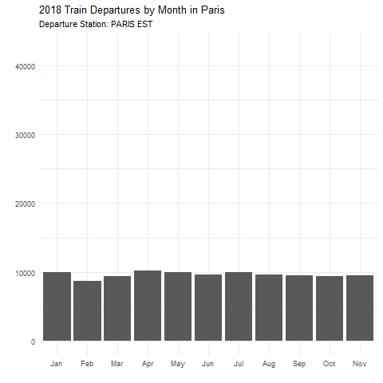
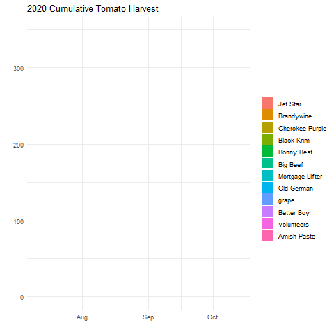
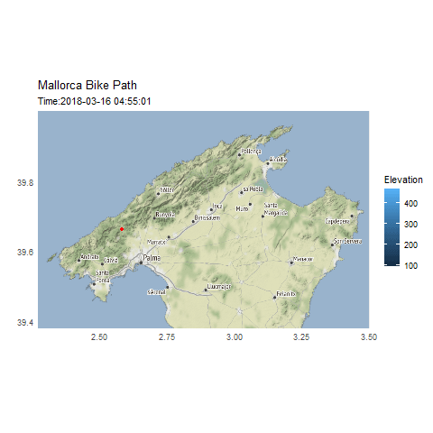
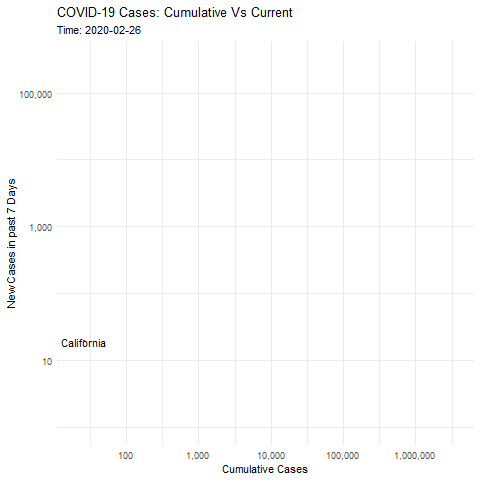
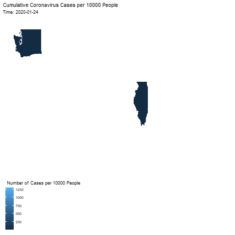

```r
library(tidyverse)     # for data cleaning and plotting
library(gardenR)       # for Lisa's garden data
library(lubridate)     # for date manipulation
library(openintro)     # for the abbr2state() function
library(palmerpenguins)# for Palmer penguin data
library(maps)          # for map data
library(ggmap)         # for mapping points on maps
library(gplots)        # for col2hex() function
library(RColorBrewer)  # for color palettes
library(sf)            # for working with spatial data
library(leaflet)       # for highly customizable mapping
library(ggthemes)      # for more themes (including theme_map())
library(plotly)        # for the ggplotly() - basic interactivity
library(gganimate)     # for adding animation layers to ggplots
library(transformr)    # for "tweening" (gganimate)
library(gifski)        # need the library for creating gifs but don't need to load each time
theme_set(theme_minimal())
```


```r
# SNCF Train data
small_trains <- read_csv("https://raw.githubusercontent.com/rfordatascience/tidytuesday/master/data/2019/2019-02-26/small_trains.csv") 

# Lisa's garden data
data("garden_harvest")

# Lisa's Mallorca cycling data
mallorca_bike_day7 <- read_csv("https://www.dropbox.com/s/zc6jan4ltmjtvy0/mallorca_bike_day7.csv?dl=1") %>% 
  select(1:4, speed)

# Heather Lendway's Ironman 70.3 Pan Am championships Panama data
panama_swim <- read_csv("https://raw.githubusercontent.com/llendway/gps-data/master/data/panama_swim_20160131.csv")

panama_bike <- read_csv("https://raw.githubusercontent.com/llendway/gps-data/master/data/panama_bike_20160131.csv")

panama_run <- read_csv("https://raw.githubusercontent.com/llendway/gps-data/master/data/panama_run_20160131.csv")

#COVID-19 data from the New York Times
covid19 <- read_csv("https://raw.githubusercontent.com/nytimes/covid-19-data/master/us-states.csv")
```

## Put your homework on GitHub!

Go [here](https://github.com/llendway/github_for_collaboration/blob/master/github_for_collaboration.md) or to previous homework to remind yourself how to get set up. 

Once your repository is created, you should always open your **project** rather than just opening an .Rmd file. You can do that by either clicking on the .Rproj file in your repository folder on your computer. Or, by going to the upper right hand corner in R Studio and clicking the arrow next to where it says Project: (None). You should see your project come up in that list if you've used it recently. You could also go to File --> Open Project and navigate to your .Rproj file. 

## Instructions

* Put your name at the top of the document. 

* **For ALL graphs, you should include appropriate labels.** 

* Feel free to change the default theme, which I currently have set to `theme_minimal()`. 

* Use good coding practice. Read the short sections on good code with [pipes](https://style.tidyverse.org/pipes.html) and [ggplot2](https://style.tidyverse.org/ggplot2.html). **This is part of your grade!**

* **NEW!!** With animated graphs, add `eval=FALSE` to the code chunk that creates the animation and saves it using `anim_save()`. Add another code chunk to reread the gif back into the file. See the [tutorial](https://animation-and-interactivity-in-r.netlify.app/) for help. 

* When you are finished with ALL the exercises, uncomment the options at the top so your document looks nicer. Don't do it before then, or else you might miss some important warnings and messages.

## Warm-up exercises from tutorial

  1. Choose 2 graphs you have created for ANY assignment in this class and add interactivity using the `ggplotly()` function.
  

```r
beet_harvest <- garden_harvest %>%
  select(vegetable,date,weight,variety)%>%
  mutate(wt_lbs = weight*0.00220462)%>%
  filter(vegetable == "beets")%>%
  group_by(variety, date) %>%
  summarise(daily_wt_lbs = sum(wt_lbs))%>%
  mutate(cum_weight_lbs = cumsum(daily_wt_lbs)) %>%
  ggplot(aes(x=date, y= cum_weight_lbs, color = variety))+
  geom_line()+
  scale_color_manual(values = c('Gourmet Golden' = "brown", 'Sweet Merlin' = "red", 'leaves' = "black"))+
  labs(title = "2020 Beets Harvest in Pounds",x ="", y = "")

ggplotly(beet_harvest)
```

```{=html}
<div id="htmlwidget-7bfe85696bf95902cf5b" style="width:672px;height:480px;" class="plotly html-widget"></div>
<script type="application/json" data-for="htmlwidget-7bfe85696bf95902cf5b">{"x":{"data":[{"x":[18450,18451,18463,18470,18487],"y":[0.13668644,0.3196699,0.55556424,0.88405262,7.0217147],"text":["date: 2020-07-07<br />cum_weight_lbs: 0.13668644<br />variety: Gourmet Golden","date: 2020-07-08<br />cum_weight_lbs: 0.31966990<br />variety: Gourmet Golden","date: 2020-07-20<br />cum_weight_lbs: 0.55556424<br />variety: Gourmet Golden","date: 2020-07-27<br />cum_weight_lbs: 0.88405262<br />variety: Gourmet Golden","date: 2020-08-13<br />cum_weight_lbs: 7.02171470<br />variety: Gourmet Golden"],"type":"scatter","mode":"lines","line":{"width":1.88976377952756,"color":"rgba(165,42,42,1)","dash":"solid"},"hoveron":"points","name":"Gourmet Golden","legendgroup":"Gourmet Golden","showlegend":true,"xaxis":"x","yaxis":"y","hoverinfo":"text","frame":null},{"x":[18424,18431,18432,18434],"y":[0.01763696,0.07275246,0.09700328,0.22266662],"text":["date: 2020-06-11<br />cum_weight_lbs: 0.01763696<br />variety: leaves","date: 2020-06-18<br />cum_weight_lbs: 0.07275246<br />variety: leaves","date: 2020-06-19<br />cum_weight_lbs: 0.09700328<br />variety: leaves","date: 2020-06-21<br />cum_weight_lbs: 0.22266662<br />variety: leaves"],"type":"scatter","mode":"lines","line":{"width":1.88976377952756,"color":"rgba(0,0,0,1)","dash":"solid"},"hoveron":"points","name":"leaves","legendgroup":"leaves","showlegend":true,"xaxis":"x","yaxis":"y","hoverinfo":"text","frame":null},{"x":[18450,18452,18455,18461,18470,18473,18487],"y":[0.0220462,0.17416498,0.37037616,0.7495708,0.85759718,1.0802638,6.38678414],"text":["date: 2020-07-07<br />cum_weight_lbs: 0.02204620<br />variety: Sweet Merlin","date: 2020-07-09<br />cum_weight_lbs: 0.17416498<br />variety: Sweet Merlin","date: 2020-07-12<br />cum_weight_lbs: 0.37037616<br />variety: Sweet Merlin","date: 2020-07-18<br />cum_weight_lbs: 0.74957080<br />variety: Sweet Merlin","date: 2020-07-27<br />cum_weight_lbs: 0.85759718<br />variety: Sweet Merlin","date: 2020-07-30<br />cum_weight_lbs: 1.08026380<br />variety: Sweet Merlin","date: 2020-08-13<br />cum_weight_lbs: 6.38678414<br />variety: Sweet Merlin"],"type":"scatter","mode":"lines","line":{"width":1.88976377952756,"color":"rgba(255,0,0,1)","dash":"solid"},"hoveron":"points","name":"Sweet Merlin","legendgroup":"Sweet Merlin","showlegend":true,"xaxis":"x","yaxis":"y","hoverinfo":"text","frame":null}],"layout":{"margin":{"t":43.7625570776256,"r":7.30593607305936,"b":25.5707762557078,"l":16.8036529680365},"font":{"color":"rgba(0,0,0,1)","family":"","size":14.6118721461187},"title":{"text":"2020 Beets Harvest in Pounds","font":{"color":"rgba(0,0,0,1)","family":"","size":17.5342465753425},"x":0,"xref":"paper"},"xaxis":{"domain":[0,1],"automargin":true,"type":"linear","autorange":false,"range":[18420.85,18490.15],"tickmode":"array","ticktext":["Jun 15","Jul 01","Jul 15","Aug 01","Aug 15"],"tickvals":[18428,18444,18458,18475,18489],"categoryorder":"array","categoryarray":["Jun 15","Jul 01","Jul 15","Aug 01","Aug 15"],"nticks":null,"ticks":"","tickcolor":null,"ticklen":3.65296803652968,"tickwidth":0,"showticklabels":true,"tickfont":{"color":"rgba(77,77,77,1)","family":"","size":11.689497716895},"tickangle":-0,"showline":false,"linecolor":null,"linewidth":0,"showgrid":true,"gridcolor":"rgba(235,235,235,1)","gridwidth":0.66417600664176,"zeroline":false,"anchor":"y","title":{"text":"","font":{"color":"rgba(0,0,0,1)","family":"","size":14.6118721461187}},"hoverformat":".2f"},"yaxis":{"domain":[0,1],"automargin":true,"type":"linear","autorange":false,"range":[-0.332566927,7.371918587],"tickmode":"array","ticktext":["0","2","4","6"],"tickvals":[0,2,4,6],"categoryorder":"array","categoryarray":["0","2","4","6"],"nticks":null,"ticks":"","tickcolor":null,"ticklen":3.65296803652968,"tickwidth":0,"showticklabels":true,"tickfont":{"color":"rgba(77,77,77,1)","family":"","size":11.689497716895},"tickangle":-0,"showline":false,"linecolor":null,"linewidth":0,"showgrid":true,"gridcolor":"rgba(235,235,235,1)","gridwidth":0.66417600664176,"zeroline":false,"anchor":"x","title":{"text":"","font":{"color":"rgba(0,0,0,1)","family":"","size":14.6118721461187}},"hoverformat":".2f"},"shapes":[{"type":"rect","fillcolor":null,"line":{"color":null,"width":0,"linetype":[]},"yref":"paper","xref":"paper","x0":0,"x1":1,"y0":0,"y1":1}],"showlegend":true,"legend":{"bgcolor":null,"bordercolor":null,"borderwidth":0,"font":{"color":"rgba(0,0,0,1)","family":"","size":11.689497716895},"y":0.93503937007874},"annotations":[{"text":"variety","x":1.02,"y":1,"showarrow":false,"ax":0,"ay":0,"font":{"color":"rgba(0,0,0,1)","family":"","size":14.6118721461187},"xref":"paper","yref":"paper","textangle":-0,"xanchor":"left","yanchor":"bottom","legendTitle":true}],"hovermode":"closest","barmode":"relative"},"config":{"doubleClick":"reset","showSendToCloud":false},"source":"A","attrs":{"2e607ec3d77":{"x":{},"y":{},"colour":{},"type":"scatter"}},"cur_data":"2e607ec3d77","visdat":{"2e607ec3d77":["function (y) ","x"]},"highlight":{"on":"plotly_click","persistent":false,"dynamic":false,"selectize":false,"opacityDim":0.2,"selected":{"opacity":1},"debounce":0},"shinyEvents":["plotly_hover","plotly_click","plotly_selected","plotly_relayout","plotly_brushed","plotly_brushing","plotly_clickannotation","plotly_doubleclick","plotly_deselect","plotly_afterplot","plotly_sunburstclick"],"base_url":"https://plot.ly"},"evals":[],"jsHooks":[]}</script>
```
  
  

```r
covid_19_mw <- covid19 %>%
  select(state, date, cases)%>%
  filter(state %in% c("Minnesota",
                      "Wisconsin",
                      "Iowa",
                      "South Dakota"))%>%
  group_by(date,state)%>%
  summarize(total_cases = cumsum(cases))

covid_19_mw_graph <- covid_19_mw %>%
  ggplot(aes(x = date, y = total_cases, color = state))+
  geom_line()+
  labs(title = "Cummulative Case Count by State")

ggplotly(covid_19_mw_graph)
```

```{=html}
<div id="htmlwidget-83bd060bad79d751683b" style="width:672px;height:480px;" class="plotly html-widget"></div>
<script type="application/json" data-for="htmlwidget-83bd060bad79d751683b">{"x":{"data":[{"x":[18329,18330,18331,18332,18333,18334,18335,18336,18337,18338,18339,18340,18341,18342,18343,18344,18345,18346,18347,18348,18349,18350,18351,18352,18353,18354,18355,18356,18357,18358,18359,18360,18361,18362,18363,18364,18365,18366,18367,18368,18369,18370,18371,18372,18373,18374,18375,18376,18377,18378,18379,18380,18381,18382,18383,18384,18385,18386,18387,18388,18389,18390,18391,18392,18393,18394,18395,18396,18397,18398,18399,18400,18401,18402,18403,18404,18405,18406,18407,18408,18409,18410,18411,18412,18413,18414,18415,18416,18417,18418,18419,18420,18421,18422,18423,18424,18425,18426,18427,18428,18429,18430,18431,18432,18433,18434,18435,18436,18437,18438,18439,18440,18441,18442,18443,18444,18445,18446,18447,18448,18449,18450,18451,18452,18453,18454,18455,18456,18457,18458,18459,18460,18461,18462,18463,18464,18465,18466,18467,18468,18469,18470,18471,18472,18473,18474,18475,18476,18477,18478,18479,18480,18481,18482,18483,18484,18485,18486,18487,18488,18489,18490,18491,18492,18493,18494,18495,18496,18497,18498,18499,18500,18501,18502,18503,18504,18505,18506,18507,18508,18509,18510,18511,18512,18513,18514,18515,18516,18517,18518,18519,18520,18521,18522,18523,18524,18525,18526,18527,18528,18529,18530,18531,18532,18533,18534,18535,18536,18537,18538,18539,18540,18541,18542,18543,18544,18545,18546,18547,18548,18549,18550,18551,18552,18553,18554,18555,18556,18557,18558,18559,18560,18561,18562,18563,18564,18565,18566,18567,18568,18569,18570,18571,18572,18573,18574,18575,18576,18577,18578,18579,18580,18581,18582,18583,18584,18585,18586,18587,18588,18589,18590,18591,18592,18593,18594,18595,18596,18597,18598,18599,18600,18601,18602,18603,18604,18605,18606,18607,18608,18609,18610,18611,18612,18613,18614,18615,18616,18617,18618,18619,18620,18621,18622,18623,18624,18625,18626,18627,18628,18629,18630,18631,18632,18633,18634,18635,18636,18637,18638,18639,18640,18641,18642,18643,18644,18645,18646,18647,18648,18649,18650,18651,18652,18653,18654,18655,18656,18657,18658,18659,18660,18661,18662,18663,18664,18665,18666,18667,18668,18669,18670,18671,18672,18673,18674,18675,18676,18677,18678,18679],"y":[3,8,13,14,16,17,18,22,22,29,38,44,45,68,90,105,124,147,179,236,298,336,424,498,549,614,699,786,868,946,1048,1145,1270,1388,1510,1587,1710,1899,1995,2141,2332,2513,2915,3175,3641,3764,3939,4459,5109,5490,5868,6376,6843,7145,7883,8641,9169,9703,10111,10404,11059,11457,11671,11959,12373,12912,13289,13675,14049,14328,14651,14955,15296,15868,16170,16510,16898,17434,17628,17999,18446,18672,19019,19336,19621,19789,20017,20376,20943,21332,21527,21794,22111,22271,22733,23103,23455,23792,23959,24110,24263,24616,24959,25424,25552,26020,26217,26470,26897,27384,27828,28203,28520,28874,29152,29618,30259,30631,31167,31612,31764,32153,32716,33316,34232,34695,35410,35631,35942,36536,37414,37903,38314,38813,39343,39721,40208,40796,41434,41886,42357,42696,42928,43623,44285,44753,45293,45723,45905,46231,46836,47559,47920,48311,48919,49164,49521,49973,50678,51272,52065,52447,52829,53201,53541,54533,55331,55996,56441,56941,57606,58864,61484,62828,63836,64599,65252,65846,66463,67693,68757,69690,70210,70537,71018,71594,72548,73399,74204,74675,75069,75722,76680,77865,78839,79785,80410,81006,81674,82956,83993,85031,85908,86624,87256,88234,89248,90483,91483,92302,92744,93261,93909,95205,96749,98023,99099,99941,100451,101531,102905,104232,105746,106698,107334,108114,109210,110444,112242,113596,114952,116238,117198,118852,120911,123232,125973,128798,131097,132697,134576,137315,142795,146267,150639,155583,159910,163827,168457,173401,178890,183557,186314,189597,193196,197532,201572,205918,209203,211664,214792,217786,221288,223323,225065,227181,228690,230634,233062,236159,238722,241531,243385,244689,245985,246237,248782,251027,253612,255009,256249,256902,258253,260784,262210,264729,266959,267329,268736,270294,272112,273661,274266,274793,275299,276649,278310,280067,281712,282980,283895,284715,286356,288298,290776,293189,294762,296171,296682,297774,299254,301161,302559,303927,304748,305151,306082,307302,308787,310440,311695,312625,313140,313907,315002,316114,317124,317689,319110,319408,320187,321274,322308,323216,323797,324306,324590,325219,326150,327061,327432,328565,329039,329258,329726,330318,330906,331502,331747,332225,332640],"text":["date: 2020-03-08<br />total_cases:      3<br />state: Iowa","date: 2020-03-09<br />total_cases:      8<br />state: Iowa","date: 2020-03-10<br />total_cases:     13<br />state: Iowa","date: 2020-03-11<br />total_cases:     14<br />state: Iowa","date: 2020-03-12<br />total_cases:     16<br />state: Iowa","date: 2020-03-13<br />total_cases:     17<br />state: Iowa","date: 2020-03-14<br />total_cases:     18<br />state: Iowa","date: 2020-03-15<br />total_cases:     22<br />state: Iowa","date: 2020-03-16<br />total_cases:     22<br />state: Iowa","date: 2020-03-17<br />total_cases:     29<br />state: Iowa","date: 2020-03-18<br />total_cases:     38<br />state: Iowa","date: 2020-03-19<br />total_cases:     44<br />state: Iowa","date: 2020-03-20<br />total_cases:     45<br />state: Iowa","date: 2020-03-21<br />total_cases:     68<br />state: Iowa","date: 2020-03-22<br />total_cases:     90<br />state: Iowa","date: 2020-03-23<br />total_cases:    105<br />state: Iowa","date: 2020-03-24<br />total_cases:    124<br />state: Iowa","date: 2020-03-25<br />total_cases:    147<br />state: Iowa","date: 2020-03-26<br />total_cases:    179<br />state: Iowa","date: 2020-03-27<br />total_cases:    236<br />state: Iowa","date: 2020-03-28<br />total_cases:    298<br />state: Iowa","date: 2020-03-29<br />total_cases:    336<br />state: Iowa","date: 2020-03-30<br />total_cases:    424<br />state: Iowa","date: 2020-03-31<br />total_cases:    498<br />state: Iowa","date: 2020-04-01<br />total_cases:    549<br />state: Iowa","date: 2020-04-02<br />total_cases:    614<br />state: Iowa","date: 2020-04-03<br />total_cases:    699<br />state: Iowa","date: 2020-04-04<br />total_cases:    786<br />state: Iowa","date: 2020-04-05<br />total_cases:    868<br />state: Iowa","date: 2020-04-06<br />total_cases:    946<br />state: Iowa","date: 2020-04-07<br />total_cases:   1048<br />state: Iowa","date: 2020-04-08<br />total_cases:   1145<br />state: Iowa","date: 2020-04-09<br />total_cases:   1270<br />state: Iowa","date: 2020-04-10<br />total_cases:   1388<br />state: Iowa","date: 2020-04-11<br />total_cases:   1510<br />state: Iowa","date: 2020-04-12<br />total_cases:   1587<br />state: Iowa","date: 2020-04-13<br />total_cases:   1710<br />state: Iowa","date: 2020-04-14<br />total_cases:   1899<br />state: Iowa","date: 2020-04-15<br />total_cases:   1995<br />state: Iowa","date: 2020-04-16<br />total_cases:   2141<br />state: Iowa","date: 2020-04-17<br />total_cases:   2332<br />state: Iowa","date: 2020-04-18<br />total_cases:   2513<br />state: Iowa","date: 2020-04-19<br />total_cases:   2915<br />state: Iowa","date: 2020-04-20<br />total_cases:   3175<br />state: Iowa","date: 2020-04-21<br />total_cases:   3641<br />state: Iowa","date: 2020-04-22<br />total_cases:   3764<br />state: Iowa","date: 2020-04-23<br />total_cases:   3939<br />state: Iowa","date: 2020-04-24<br />total_cases:   4459<br />state: Iowa","date: 2020-04-25<br />total_cases:   5109<br />state: Iowa","date: 2020-04-26<br />total_cases:   5490<br />state: Iowa","date: 2020-04-27<br />total_cases:   5868<br />state: Iowa","date: 2020-04-28<br />total_cases:   6376<br />state: Iowa","date: 2020-04-29<br />total_cases:   6843<br />state: Iowa","date: 2020-04-30<br />total_cases:   7145<br />state: Iowa","date: 2020-05-01<br />total_cases:   7883<br />state: Iowa","date: 2020-05-02<br />total_cases:   8641<br />state: Iowa","date: 2020-05-03<br />total_cases:   9169<br />state: Iowa","date: 2020-05-04<br />total_cases:   9703<br />state: Iowa","date: 2020-05-05<br />total_cases:  10111<br />state: Iowa","date: 2020-05-06<br />total_cases:  10404<br />state: Iowa","date: 2020-05-07<br />total_cases:  11059<br />state: Iowa","date: 2020-05-08<br />total_cases:  11457<br />state: Iowa","date: 2020-05-09<br />total_cases:  11671<br />state: Iowa","date: 2020-05-10<br />total_cases:  11959<br />state: Iowa","date: 2020-05-11<br />total_cases:  12373<br />state: Iowa","date: 2020-05-12<br />total_cases:  12912<br />state: Iowa","date: 2020-05-13<br />total_cases:  13289<br />state: Iowa","date: 2020-05-14<br />total_cases:  13675<br />state: Iowa","date: 2020-05-15<br />total_cases:  14049<br />state: Iowa","date: 2020-05-16<br />total_cases:  14328<br />state: Iowa","date: 2020-05-17<br />total_cases:  14651<br />state: Iowa","date: 2020-05-18<br />total_cases:  14955<br />state: Iowa","date: 2020-05-19<br />total_cases:  15296<br />state: Iowa","date: 2020-05-20<br />total_cases:  15868<br />state: Iowa","date: 2020-05-21<br />total_cases:  16170<br />state: Iowa","date: 2020-05-22<br />total_cases:  16510<br />state: Iowa","date: 2020-05-23<br />total_cases:  16898<br />state: Iowa","date: 2020-05-24<br />total_cases:  17434<br />state: Iowa","date: 2020-05-25<br />total_cases:  17628<br />state: Iowa","date: 2020-05-26<br />total_cases:  17999<br />state: Iowa","date: 2020-05-27<br />total_cases:  18446<br />state: Iowa","date: 2020-05-28<br />total_cases:  18672<br />state: Iowa","date: 2020-05-29<br />total_cases:  19019<br />state: Iowa","date: 2020-05-30<br />total_cases:  19336<br />state: Iowa","date: 2020-05-31<br />total_cases:  19621<br />state: Iowa","date: 2020-06-01<br />total_cases:  19789<br />state: Iowa","date: 2020-06-02<br />total_cases:  20017<br />state: Iowa","date: 2020-06-03<br />total_cases:  20376<br />state: Iowa","date: 2020-06-04<br />total_cases:  20943<br />state: Iowa","date: 2020-06-05<br />total_cases:  21332<br />state: Iowa","date: 2020-06-06<br />total_cases:  21527<br />state: Iowa","date: 2020-06-07<br />total_cases:  21794<br />state: Iowa","date: 2020-06-08<br />total_cases:  22111<br />state: Iowa","date: 2020-06-09<br />total_cases:  22271<br />state: Iowa","date: 2020-06-10<br />total_cases:  22733<br />state: Iowa","date: 2020-06-11<br />total_cases:  23103<br />state: Iowa","date: 2020-06-12<br />total_cases:  23455<br />state: Iowa","date: 2020-06-13<br />total_cases:  23792<br />state: Iowa","date: 2020-06-14<br />total_cases:  23959<br />state: Iowa","date: 2020-06-15<br />total_cases:  24110<br />state: Iowa","date: 2020-06-16<br />total_cases:  24263<br />state: Iowa","date: 2020-06-17<br />total_cases:  24616<br />state: Iowa","date: 2020-06-18<br />total_cases:  24959<br />state: Iowa","date: 2020-06-19<br />total_cases:  25424<br />state: Iowa","date: 2020-06-20<br />total_cases:  25552<br />state: Iowa","date: 2020-06-21<br />total_cases:  26020<br />state: Iowa","date: 2020-06-22<br />total_cases:  26217<br />state: Iowa","date: 2020-06-23<br />total_cases:  26470<br />state: Iowa","date: 2020-06-24<br />total_cases:  26897<br />state: Iowa","date: 2020-06-25<br />total_cases:  27384<br />state: Iowa","date: 2020-06-26<br />total_cases:  27828<br />state: Iowa","date: 2020-06-27<br />total_cases:  28203<br />state: Iowa","date: 2020-06-28<br />total_cases:  28520<br />state: Iowa","date: 2020-06-29<br />total_cases:  28874<br />state: Iowa","date: 2020-06-30<br />total_cases:  29152<br />state: Iowa","date: 2020-07-01<br />total_cases:  29618<br />state: Iowa","date: 2020-07-02<br />total_cases:  30259<br />state: Iowa","date: 2020-07-03<br />total_cases:  30631<br />state: Iowa","date: 2020-07-04<br />total_cases:  31167<br />state: Iowa","date: 2020-07-05<br />total_cases:  31612<br />state: Iowa","date: 2020-07-06<br />total_cases:  31764<br />state: Iowa","date: 2020-07-07<br />total_cases:  32153<br />state: Iowa","date: 2020-07-08<br />total_cases:  32716<br />state: Iowa","date: 2020-07-09<br />total_cases:  33316<br />state: Iowa","date: 2020-07-10<br />total_cases:  34232<br />state: Iowa","date: 2020-07-11<br />total_cases:  34695<br />state: Iowa","date: 2020-07-12<br />total_cases:  35410<br />state: Iowa","date: 2020-07-13<br />total_cases:  35631<br />state: Iowa","date: 2020-07-14<br />total_cases:  35942<br />state: Iowa","date: 2020-07-15<br />total_cases:  36536<br />state: Iowa","date: 2020-07-16<br />total_cases:  37414<br />state: Iowa","date: 2020-07-17<br />total_cases:  37903<br />state: Iowa","date: 2020-07-18<br />total_cases:  38314<br />state: Iowa","date: 2020-07-19<br />total_cases:  38813<br />state: Iowa","date: 2020-07-20<br />total_cases:  39343<br />state: Iowa","date: 2020-07-21<br />total_cases:  39721<br />state: Iowa","date: 2020-07-22<br />total_cases:  40208<br />state: Iowa","date: 2020-07-23<br />total_cases:  40796<br />state: Iowa","date: 2020-07-24<br />total_cases:  41434<br />state: Iowa","date: 2020-07-25<br />total_cases:  41886<br />state: Iowa","date: 2020-07-26<br />total_cases:  42357<br />state: Iowa","date: 2020-07-27<br />total_cases:  42696<br />state: Iowa","date: 2020-07-28<br />total_cases:  42928<br />state: Iowa","date: 2020-07-29<br />total_cases:  43623<br />state: Iowa","date: 2020-07-30<br />total_cases:  44285<br />state: Iowa","date: 2020-07-31<br />total_cases:  44753<br />state: Iowa","date: 2020-08-01<br />total_cases:  45293<br />state: Iowa","date: 2020-08-02<br />total_cases:  45723<br />state: Iowa","date: 2020-08-03<br />total_cases:  45905<br />state: Iowa","date: 2020-08-04<br />total_cases:  46231<br />state: Iowa","date: 2020-08-05<br />total_cases:  46836<br />state: Iowa","date: 2020-08-06<br />total_cases:  47559<br />state: Iowa","date: 2020-08-07<br />total_cases:  47920<br />state: Iowa","date: 2020-08-08<br />total_cases:  48311<br />state: Iowa","date: 2020-08-09<br />total_cases:  48919<br />state: Iowa","date: 2020-08-10<br />total_cases:  49164<br />state: Iowa","date: 2020-08-11<br />total_cases:  49521<br />state: Iowa","date: 2020-08-12<br />total_cases:  49973<br />state: Iowa","date: 2020-08-13<br />total_cases:  50678<br />state: Iowa","date: 2020-08-14<br />total_cases:  51272<br />state: Iowa","date: 2020-08-15<br />total_cases:  52065<br />state: Iowa","date: 2020-08-16<br />total_cases:  52447<br />state: Iowa","date: 2020-08-17<br />total_cases:  52829<br />state: Iowa","date: 2020-08-18<br />total_cases:  53201<br />state: Iowa","date: 2020-08-19<br />total_cases:  53541<br />state: Iowa","date: 2020-08-20<br />total_cases:  54533<br />state: Iowa","date: 2020-08-21<br />total_cases:  55331<br />state: Iowa","date: 2020-08-22<br />total_cases:  55996<br />state: Iowa","date: 2020-08-23<br />total_cases:  56441<br />state: Iowa","date: 2020-08-24<br />total_cases:  56941<br />state: Iowa","date: 2020-08-25<br />total_cases:  57606<br />state: Iowa","date: 2020-08-26<br />total_cases:  58864<br />state: Iowa","date: 2020-08-27<br />total_cases:  61484<br />state: Iowa","date: 2020-08-28<br />total_cases:  62828<br />state: Iowa","date: 2020-08-29<br />total_cases:  63836<br />state: Iowa","date: 2020-08-30<br />total_cases:  64599<br />state: Iowa","date: 2020-08-31<br />total_cases:  65252<br />state: Iowa","date: 2020-09-01<br />total_cases:  65846<br />state: Iowa","date: 2020-09-02<br />total_cases:  66463<br />state: Iowa","date: 2020-09-03<br />total_cases:  67693<br />state: Iowa","date: 2020-09-04<br />total_cases:  68757<br />state: Iowa","date: 2020-09-05<br />total_cases:  69690<br />state: Iowa","date: 2020-09-06<br />total_cases:  70210<br />state: Iowa","date: 2020-09-07<br />total_cases:  70537<br />state: Iowa","date: 2020-09-08<br />total_cases:  71018<br />state: Iowa","date: 2020-09-09<br />total_cases:  71594<br />state: Iowa","date: 2020-09-10<br />total_cases:  72548<br />state: Iowa","date: 2020-09-11<br />total_cases:  73399<br />state: Iowa","date: 2020-09-12<br />total_cases:  74204<br />state: Iowa","date: 2020-09-13<br />total_cases:  74675<br />state: Iowa","date: 2020-09-14<br />total_cases:  75069<br />state: Iowa","date: 2020-09-15<br />total_cases:  75722<br />state: Iowa","date: 2020-09-16<br />total_cases:  76680<br />state: Iowa","date: 2020-09-17<br />total_cases:  77865<br />state: Iowa","date: 2020-09-18<br />total_cases:  78839<br />state: Iowa","date: 2020-09-19<br />total_cases:  79785<br />state: Iowa","date: 2020-09-20<br />total_cases:  80410<br />state: Iowa","date: 2020-09-21<br />total_cases:  81006<br />state: Iowa","date: 2020-09-22<br />total_cases:  81674<br />state: Iowa","date: 2020-09-23<br />total_cases:  82956<br />state: Iowa","date: 2020-09-24<br />total_cases:  83993<br />state: Iowa","date: 2020-09-25<br />total_cases:  85031<br />state: Iowa","date: 2020-09-26<br />total_cases:  85908<br />state: Iowa","date: 2020-09-27<br />total_cases:  86624<br />state: Iowa","date: 2020-09-28<br />total_cases:  87256<br />state: Iowa","date: 2020-09-29<br />total_cases:  88234<br />state: Iowa","date: 2020-09-30<br />total_cases:  89248<br />state: Iowa","date: 2020-10-01<br />total_cases:  90483<br />state: Iowa","date: 2020-10-02<br />total_cases:  91483<br />state: Iowa","date: 2020-10-03<br />total_cases:  92302<br />state: Iowa","date: 2020-10-04<br />total_cases:  92744<br />state: Iowa","date: 2020-10-05<br />total_cases:  93261<br />state: Iowa","date: 2020-10-06<br />total_cases:  93909<br />state: Iowa","date: 2020-10-07<br />total_cases:  95205<br />state: Iowa","date: 2020-10-08<br />total_cases:  96749<br />state: Iowa","date: 2020-10-09<br />total_cases:  98023<br />state: Iowa","date: 2020-10-10<br />total_cases:  99099<br />state: Iowa","date: 2020-10-11<br />total_cases:  99941<br />state: Iowa","date: 2020-10-12<br />total_cases: 100451<br />state: Iowa","date: 2020-10-13<br />total_cases: 101531<br />state: Iowa","date: 2020-10-14<br />total_cases: 102905<br />state: Iowa","date: 2020-10-15<br />total_cases: 104232<br />state: Iowa","date: 2020-10-16<br />total_cases: 105746<br />state: Iowa","date: 2020-10-17<br />total_cases: 106698<br />state: Iowa","date: 2020-10-18<br />total_cases: 107334<br />state: Iowa","date: 2020-10-19<br />total_cases: 108114<br />state: Iowa","date: 2020-10-20<br />total_cases: 109210<br />state: Iowa","date: 2020-10-21<br />total_cases: 110444<br />state: Iowa","date: 2020-10-22<br />total_cases: 112242<br />state: Iowa","date: 2020-10-23<br />total_cases: 113596<br />state: Iowa","date: 2020-10-24<br />total_cases: 114952<br />state: Iowa","date: 2020-10-25<br />total_cases: 116238<br />state: Iowa","date: 2020-10-26<br />total_cases: 117198<br />state: Iowa","date: 2020-10-27<br />total_cases: 118852<br />state: Iowa","date: 2020-10-28<br />total_cases: 120911<br />state: Iowa","date: 2020-10-29<br />total_cases: 123232<br />state: Iowa","date: 2020-10-30<br />total_cases: 125973<br />state: Iowa","date: 2020-10-31<br />total_cases: 128798<br />state: Iowa","date: 2020-11-01<br />total_cases: 131097<br />state: Iowa","date: 2020-11-02<br />total_cases: 132697<br />state: Iowa","date: 2020-11-03<br />total_cases: 134576<br />state: Iowa","date: 2020-11-04<br />total_cases: 137315<br />state: Iowa","date: 2020-11-05<br />total_cases: 142795<br />state: Iowa","date: 2020-11-06<br />total_cases: 146267<br />state: Iowa","date: 2020-11-07<br />total_cases: 150639<br />state: Iowa","date: 2020-11-08<br />total_cases: 155583<br />state: Iowa","date: 2020-11-09<br />total_cases: 159910<br />state: Iowa","date: 2020-11-10<br />total_cases: 163827<br />state: Iowa","date: 2020-11-11<br />total_cases: 168457<br />state: Iowa","date: 2020-11-12<br />total_cases: 173401<br />state: Iowa","date: 2020-11-13<br />total_cases: 178890<br />state: Iowa","date: 2020-11-14<br />total_cases: 183557<br />state: Iowa","date: 2020-11-15<br />total_cases: 186314<br />state: Iowa","date: 2020-11-16<br />total_cases: 189597<br />state: Iowa","date: 2020-11-17<br />total_cases: 193196<br />state: Iowa","date: 2020-11-18<br />total_cases: 197532<br />state: Iowa","date: 2020-11-19<br />total_cases: 201572<br />state: Iowa","date: 2020-11-20<br />total_cases: 205918<br />state: Iowa","date: 2020-11-21<br />total_cases: 209203<br />state: Iowa","date: 2020-11-22<br />total_cases: 211664<br />state: Iowa","date: 2020-11-23<br />total_cases: 214792<br />state: Iowa","date: 2020-11-24<br />total_cases: 217786<br />state: Iowa","date: 2020-11-25<br />total_cases: 221288<br />state: Iowa","date: 2020-11-26<br />total_cases: 223323<br />state: Iowa","date: 2020-11-27<br />total_cases: 225065<br />state: Iowa","date: 2020-11-28<br />total_cases: 227181<br />state: Iowa","date: 2020-11-29<br />total_cases: 228690<br />state: Iowa","date: 2020-11-30<br />total_cases: 230634<br />state: Iowa","date: 2020-12-01<br />total_cases: 233062<br />state: Iowa","date: 2020-12-02<br />total_cases: 236159<br />state: Iowa","date: 2020-12-03<br />total_cases: 238722<br />state: Iowa","date: 2020-12-04<br />total_cases: 241531<br />state: Iowa","date: 2020-12-05<br />total_cases: 243385<br />state: Iowa","date: 2020-12-06<br />total_cases: 244689<br />state: Iowa","date: 2020-12-07<br />total_cases: 245985<br />state: Iowa","date: 2020-12-08<br />total_cases: 246237<br />state: Iowa","date: 2020-12-09<br />total_cases: 248782<br />state: Iowa","date: 2020-12-10<br />total_cases: 251027<br />state: Iowa","date: 2020-12-11<br />total_cases: 253612<br />state: Iowa","date: 2020-12-12<br />total_cases: 255009<br />state: Iowa","date: 2020-12-13<br />total_cases: 256249<br />state: Iowa","date: 2020-12-14<br />total_cases: 256902<br />state: Iowa","date: 2020-12-15<br />total_cases: 258253<br />state: Iowa","date: 2020-12-16<br />total_cases: 260784<br />state: Iowa","date: 2020-12-17<br />total_cases: 262210<br />state: Iowa","date: 2020-12-18<br />total_cases: 264729<br />state: Iowa","date: 2020-12-19<br />total_cases: 266959<br />state: Iowa","date: 2020-12-20<br />total_cases: 267329<br />state: Iowa","date: 2020-12-21<br />total_cases: 268736<br />state: Iowa","date: 2020-12-22<br />total_cases: 270294<br />state: Iowa","date: 2020-12-23<br />total_cases: 272112<br />state: Iowa","date: 2020-12-24<br />total_cases: 273661<br />state: Iowa","date: 2020-12-25<br />total_cases: 274266<br />state: Iowa","date: 2020-12-26<br />total_cases: 274793<br />state: Iowa","date: 2020-12-27<br />total_cases: 275299<br />state: Iowa","date: 2020-12-28<br />total_cases: 276649<br />state: Iowa","date: 2020-12-29<br />total_cases: 278310<br />state: Iowa","date: 2020-12-30<br />total_cases: 280067<br />state: Iowa","date: 2020-12-31<br />total_cases: 281712<br />state: Iowa","date: 2021-01-01<br />total_cases: 282980<br />state: Iowa","date: 2021-01-02<br />total_cases: 283895<br />state: Iowa","date: 2021-01-03<br />total_cases: 284715<br />state: Iowa","date: 2021-01-04<br />total_cases: 286356<br />state: Iowa","date: 2021-01-05<br />total_cases: 288298<br />state: Iowa","date: 2021-01-06<br />total_cases: 290776<br />state: Iowa","date: 2021-01-07<br />total_cases: 293189<br />state: Iowa","date: 2021-01-08<br />total_cases: 294762<br />state: Iowa","date: 2021-01-09<br />total_cases: 296171<br />state: Iowa","date: 2021-01-10<br />total_cases: 296682<br />state: Iowa","date: 2021-01-11<br />total_cases: 297774<br />state: Iowa","date: 2021-01-12<br />total_cases: 299254<br />state: Iowa","date: 2021-01-13<br />total_cases: 301161<br />state: Iowa","date: 2021-01-14<br />total_cases: 302559<br />state: Iowa","date: 2021-01-15<br />total_cases: 303927<br />state: Iowa","date: 2021-01-16<br />total_cases: 304748<br />state: Iowa","date: 2021-01-17<br />total_cases: 305151<br />state: Iowa","date: 2021-01-18<br />total_cases: 306082<br />state: Iowa","date: 2021-01-19<br />total_cases: 307302<br />state: Iowa","date: 2021-01-20<br />total_cases: 308787<br />state: Iowa","date: 2021-01-21<br />total_cases: 310440<br />state: Iowa","date: 2021-01-22<br />total_cases: 311695<br />state: Iowa","date: 2021-01-23<br />total_cases: 312625<br />state: Iowa","date: 2021-01-24<br />total_cases: 313140<br />state: Iowa","date: 2021-01-25<br />total_cases: 313907<br />state: Iowa","date: 2021-01-26<br />total_cases: 315002<br />state: Iowa","date: 2021-01-27<br />total_cases: 316114<br />state: Iowa","date: 2021-01-28<br />total_cases: 317124<br />state: Iowa","date: 2021-01-29<br />total_cases: 317689<br />state: Iowa","date: 2021-01-30<br />total_cases: 319110<br />state: Iowa","date: 2021-01-31<br />total_cases: 319408<br />state: Iowa","date: 2021-02-01<br />total_cases: 320187<br />state: Iowa","date: 2021-02-02<br />total_cases: 321274<br />state: Iowa","date: 2021-02-03<br />total_cases: 322308<br />state: Iowa","date: 2021-02-04<br />total_cases: 323216<br />state: Iowa","date: 2021-02-05<br />total_cases: 323797<br />state: Iowa","date: 2021-02-06<br />total_cases: 324306<br />state: Iowa","date: 2021-02-07<br />total_cases: 324590<br />state: Iowa","date: 2021-02-08<br />total_cases: 325219<br />state: Iowa","date: 2021-02-09<br />total_cases: 326150<br />state: Iowa","date: 2021-02-10<br />total_cases: 327061<br />state: Iowa","date: 2021-02-11<br />total_cases: 327432<br />state: Iowa","date: 2021-02-12<br />total_cases: 328565<br />state: Iowa","date: 2021-02-13<br />total_cases: 329039<br />state: Iowa","date: 2021-02-14<br />total_cases: 329258<br />state: Iowa","date: 2021-02-15<br />total_cases: 329726<br />state: Iowa","date: 2021-02-16<br />total_cases: 330318<br />state: Iowa","date: 2021-02-17<br />total_cases: 330906<br />state: Iowa","date: 2021-02-18<br />total_cases: 331502<br />state: Iowa","date: 2021-02-19<br />total_cases: 331747<br />state: Iowa","date: 2021-02-20<br />total_cases: 332225<br />state: Iowa","date: 2021-02-21<br />total_cases: 332640<br />state: Iowa"],"type":"scatter","mode":"lines","line":{"width":1.88976377952756,"color":"rgba(248,118,109,1)","dash":"solid"},"hoveron":"points","name":"Iowa","legendgroup":"Iowa","showlegend":true,"xaxis":"x","yaxis":"y","hoverinfo":"text","frame":null},{"x":[18327,18328,18329,18330,18331,18332,18333,18334,18335,18336,18337,18338,18339,18340,18341,18342,18343,18344,18345,18346,18347,18348,18349,18350,18351,18352,18353,18354,18355,18356,18357,18358,18359,18360,18361,18362,18363,18364,18365,18366,18367,18368,18369,18370,18371,18372,18373,18374,18375,18376,18377,18378,18379,18380,18381,18382,18383,18384,18385,18386,18387,18388,18389,18390,18391,18392,18393,18394,18395,18396,18397,18398,18399,18400,18401,18402,18403,18404,18405,18406,18407,18408,18409,18410,18411,18412,18413,18414,18415,18416,18417,18418,18419,18420,18421,18422,18423,18424,18425,18426,18427,18428,18429,18430,18431,18432,18433,18434,18435,18436,18437,18438,18439,18440,18441,18442,18443,18444,18445,18446,18447,18448,18449,18450,18451,18452,18453,18454,18455,18456,18457,18458,18459,18460,18461,18462,18463,18464,18465,18466,18467,18468,18469,18470,18471,18472,18473,18474,18475,18476,18477,18478,18479,18480,18481,18482,18483,18484,18485,18486,18487,18488,18489,18490,18491,18492,18493,18494,18495,18496,18497,18498,18499,18500,18501,18502,18503,18504,18505,18506,18507,18508,18509,18510,18511,18512,18513,18514,18515,18516,18517,18518,18519,18520,18521,18522,18523,18524,18525,18526,18527,18528,18529,18530,18531,18532,18533,18534,18535,18536,18537,18538,18539,18540,18541,18542,18543,18544,18545,18546,18547,18548,18549,18550,18551,18552,18553,18554,18555,18556,18557,18558,18559,18560,18561,18562,18563,18564,18565,18566,18567,18568,18569,18570,18571,18572,18573,18574,18575,18576,18577,18578,18579,18580,18581,18582,18583,18584,18585,18586,18587,18588,18589,18590,18591,18592,18593,18594,18595,18596,18597,18598,18599,18600,18601,18602,18603,18604,18605,18606,18607,18608,18609,18610,18611,18612,18613,18614,18615,18616,18617,18618,18619,18620,18621,18622,18623,18624,18625,18626,18627,18628,18629,18630,18631,18632,18633,18634,18635,18636,18637,18638,18639,18640,18641,18642,18643,18644,18645,18646,18647,18648,18649,18650,18651,18652,18653,18654,18655,18656,18657,18658,18659,18660,18661,18662,18663,18664,18665,18666,18667,18668,18669,18670,18671,18672,18673,18674,18675,18676,18677,18678,18679],"y":[1,1,2,2,3,5,9,14,21,35,54,60,77,89,115,138,171,235,264,289,346,398,442,504,576,629,689,742,789,865,935,986,1069,1154,1242,1335,1427,1621,1650,1695,1809,1912,2071,2213,2356,2470,2567,2721,2942,3185,3446,3602,3816,4181,4644,5136,5730,6228,6663,7234,7851,8579,9364,10087,10789,11270,11798,12493,12916,13443,14240,14969,15677,16372,17038,17679,18209,19014,19854,20582,21324,21969,22474,22957,23541,24200,24860,25218,25518,25881,26284,26991,27512,27897,28235,28534,28900,29347,29826,30203,30502,30724,30913,31328,31707,32063,32499,32952,33259,33501,33798,34158,34651,35068,35584,35896,36338,36753,37247,37661,37661,38173,38606,39170,39627,40201,40805,41609,42319,42810,43208,43782,44387,45053,45510,46244,47147,47497,48001,48761,49528,50331,51193,51843,52321,52987,53732,54503,55228,55987,56600,57202,57820,58681,59226,60142,60939,61557,61880,62349,63039,63769,64459,65198,65762,66107,66664,67354,68179,68913,69630,70344,70753,71285,72439,73289,74306,75238,75913,76404,77137,78175,79018,79932,80639,81277,81660,81920,82301,82768,83640,84363,85001,85403,85865,86774,87859,88773,90069,90994,91474,92152,93064,94241,95711,96786,97690,98499,99187,100253,101419,102840,103879,104852,105793,106704,107975,109365,110881,112321,113492,114627,115996,117159,119449,121143,122865,124492,125584,126644,128205,129916,132175,133855,135425,137589,139497,142364,145519,148526,150726,153674,157150,160977,164919,170361,175008,180916,184842,189735,194626,201851,207395,216084,223637,231074,237005,242099,249962,256756,263008,270213,276556,282972,289362,289362,295060,304082,313028,318822,322371,327536,333685,339032,345340,350921,356211,359262,363778,367277,371027,375457,378882,381900,384223,386471,389230,391948,394694,397378,399370,401070,402578,404462,404462,406604,409120,410197,411169,413166,415361,415361,417891,420603,423747,425320,427655,429638,432012,434481,436640,437620,438935,440422,442003,443630,445115,446448,447417,448336,449560,450830,452336,453876,455057,455851,456558,457385,458701,459815,460887,461875,462596,463200,463834,465244,466292,467285,468186,468750,469322,469973,470871,471919,472859,473635,474237,474689,475447,476360,477355,478225,479104],"text":["date: 2020-03-06<br />total_cases:      1<br />state: Minnesota","date: 2020-03-07<br />total_cases:      1<br />state: Minnesota","date: 2020-03-08<br />total_cases:      2<br />state: Minnesota","date: 2020-03-09<br />total_cases:      2<br />state: Minnesota","date: 2020-03-10<br />total_cases:      3<br />state: Minnesota","date: 2020-03-11<br />total_cases:      5<br />state: Minnesota","date: 2020-03-12<br />total_cases:      9<br />state: Minnesota","date: 2020-03-13<br />total_cases:     14<br />state: Minnesota","date: 2020-03-14<br />total_cases:     21<br />state: Minnesota","date: 2020-03-15<br />total_cases:     35<br />state: Minnesota","date: 2020-03-16<br />total_cases:     54<br />state: Minnesota","date: 2020-03-17<br />total_cases:     60<br />state: Minnesota","date: 2020-03-18<br />total_cases:     77<br />state: Minnesota","date: 2020-03-19<br />total_cases:     89<br />state: Minnesota","date: 2020-03-20<br />total_cases:    115<br />state: Minnesota","date: 2020-03-21<br />total_cases:    138<br />state: Minnesota","date: 2020-03-22<br />total_cases:    171<br />state: Minnesota","date: 2020-03-23<br />total_cases:    235<br />state: Minnesota","date: 2020-03-24<br />total_cases:    264<br />state: Minnesota","date: 2020-03-25<br />total_cases:    289<br />state: Minnesota","date: 2020-03-26<br />total_cases:    346<br />state: Minnesota","date: 2020-03-27<br />total_cases:    398<br />state: Minnesota","date: 2020-03-28<br />total_cases:    442<br />state: Minnesota","date: 2020-03-29<br />total_cases:    504<br />state: Minnesota","date: 2020-03-30<br />total_cases:    576<br />state: Minnesota","date: 2020-03-31<br />total_cases:    629<br />state: Minnesota","date: 2020-04-01<br />total_cases:    689<br />state: Minnesota","date: 2020-04-02<br />total_cases:    742<br />state: Minnesota","date: 2020-04-03<br />total_cases:    789<br />state: Minnesota","date: 2020-04-04<br />total_cases:    865<br />state: Minnesota","date: 2020-04-05<br />total_cases:    935<br />state: Minnesota","date: 2020-04-06<br />total_cases:    986<br />state: Minnesota","date: 2020-04-07<br />total_cases:   1069<br />state: Minnesota","date: 2020-04-08<br />total_cases:   1154<br />state: Minnesota","date: 2020-04-09<br />total_cases:   1242<br />state: Minnesota","date: 2020-04-10<br />total_cases:   1335<br />state: Minnesota","date: 2020-04-11<br />total_cases:   1427<br />state: Minnesota","date: 2020-04-12<br />total_cases:   1621<br />state: Minnesota","date: 2020-04-13<br />total_cases:   1650<br />state: Minnesota","date: 2020-04-14<br />total_cases:   1695<br />state: Minnesota","date: 2020-04-15<br />total_cases:   1809<br />state: Minnesota","date: 2020-04-16<br />total_cases:   1912<br />state: Minnesota","date: 2020-04-17<br />total_cases:   2071<br />state: Minnesota","date: 2020-04-18<br />total_cases:   2213<br />state: Minnesota","date: 2020-04-19<br />total_cases:   2356<br />state: Minnesota","date: 2020-04-20<br />total_cases:   2470<br />state: Minnesota","date: 2020-04-21<br />total_cases:   2567<br />state: Minnesota","date: 2020-04-22<br />total_cases:   2721<br />state: Minnesota","date: 2020-04-23<br />total_cases:   2942<br />state: Minnesota","date: 2020-04-24<br />total_cases:   3185<br />state: Minnesota","date: 2020-04-25<br />total_cases:   3446<br />state: Minnesota","date: 2020-04-26<br />total_cases:   3602<br />state: Minnesota","date: 2020-04-27<br />total_cases:   3816<br />state: Minnesota","date: 2020-04-28<br />total_cases:   4181<br />state: Minnesota","date: 2020-04-29<br />total_cases:   4644<br />state: Minnesota","date: 2020-04-30<br />total_cases:   5136<br />state: Minnesota","date: 2020-05-01<br />total_cases:   5730<br />state: Minnesota","date: 2020-05-02<br />total_cases:   6228<br />state: Minnesota","date: 2020-05-03<br />total_cases:   6663<br />state: Minnesota","date: 2020-05-04<br />total_cases:   7234<br />state: Minnesota","date: 2020-05-05<br />total_cases:   7851<br />state: Minnesota","date: 2020-05-06<br />total_cases:   8579<br />state: Minnesota","date: 2020-05-07<br />total_cases:   9364<br />state: Minnesota","date: 2020-05-08<br />total_cases:  10087<br />state: Minnesota","date: 2020-05-09<br />total_cases:  10789<br />state: Minnesota","date: 2020-05-10<br />total_cases:  11270<br />state: Minnesota","date: 2020-05-11<br />total_cases:  11798<br />state: Minnesota","date: 2020-05-12<br />total_cases:  12493<br />state: Minnesota","date: 2020-05-13<br />total_cases:  12916<br />state: Minnesota","date: 2020-05-14<br />total_cases:  13443<br />state: Minnesota","date: 2020-05-15<br />total_cases:  14240<br />state: Minnesota","date: 2020-05-16<br />total_cases:  14969<br />state: Minnesota","date: 2020-05-17<br />total_cases:  15677<br />state: Minnesota","date: 2020-05-18<br />total_cases:  16372<br />state: Minnesota","date: 2020-05-19<br />total_cases:  17038<br />state: Minnesota","date: 2020-05-20<br />total_cases:  17679<br />state: Minnesota","date: 2020-05-21<br />total_cases:  18209<br />state: Minnesota","date: 2020-05-22<br />total_cases:  19014<br />state: Minnesota","date: 2020-05-23<br />total_cases:  19854<br />state: Minnesota","date: 2020-05-24<br />total_cases:  20582<br />state: Minnesota","date: 2020-05-25<br />total_cases:  21324<br />state: Minnesota","date: 2020-05-26<br />total_cases:  21969<br />state: Minnesota","date: 2020-05-27<br />total_cases:  22474<br />state: Minnesota","date: 2020-05-28<br />total_cases:  22957<br />state: Minnesota","date: 2020-05-29<br />total_cases:  23541<br />state: Minnesota","date: 2020-05-30<br />total_cases:  24200<br />state: Minnesota","date: 2020-05-31<br />total_cases:  24860<br />state: Minnesota","date: 2020-06-01<br />total_cases:  25218<br />state: Minnesota","date: 2020-06-02<br />total_cases:  25518<br />state: Minnesota","date: 2020-06-03<br />total_cases:  25881<br />state: Minnesota","date: 2020-06-04<br />total_cases:  26284<br />state: Minnesota","date: 2020-06-05<br />total_cases:  26991<br />state: Minnesota","date: 2020-06-06<br />total_cases:  27512<br />state: Minnesota","date: 2020-06-07<br />total_cases:  27897<br />state: Minnesota","date: 2020-06-08<br />total_cases:  28235<br />state: Minnesota","date: 2020-06-09<br />total_cases:  28534<br />state: Minnesota","date: 2020-06-10<br />total_cases:  28900<br />state: Minnesota","date: 2020-06-11<br />total_cases:  29347<br />state: Minnesota","date: 2020-06-12<br />total_cases:  29826<br />state: Minnesota","date: 2020-06-13<br />total_cases:  30203<br />state: Minnesota","date: 2020-06-14<br />total_cases:  30502<br />state: Minnesota","date: 2020-06-15<br />total_cases:  30724<br />state: Minnesota","date: 2020-06-16<br />total_cases:  30913<br />state: Minnesota","date: 2020-06-17<br />total_cases:  31328<br />state: Minnesota","date: 2020-06-18<br />total_cases:  31707<br />state: Minnesota","date: 2020-06-19<br />total_cases:  32063<br />state: Minnesota","date: 2020-06-20<br />total_cases:  32499<br />state: Minnesota","date: 2020-06-21<br />total_cases:  32952<br />state: Minnesota","date: 2020-06-22<br />total_cases:  33259<br />state: Minnesota","date: 2020-06-23<br />total_cases:  33501<br />state: Minnesota","date: 2020-06-24<br />total_cases:  33798<br />state: Minnesota","date: 2020-06-25<br />total_cases:  34158<br />state: Minnesota","date: 2020-06-26<br />total_cases:  34651<br />state: Minnesota","date: 2020-06-27<br />total_cases:  35068<br />state: Minnesota","date: 2020-06-28<br />total_cases:  35584<br />state: Minnesota","date: 2020-06-29<br />total_cases:  35896<br />state: Minnesota","date: 2020-06-30<br />total_cases:  36338<br />state: Minnesota","date: 2020-07-01<br />total_cases:  36753<br />state: Minnesota","date: 2020-07-02<br />total_cases:  37247<br />state: Minnesota","date: 2020-07-03<br />total_cases:  37661<br />state: Minnesota","date: 2020-07-04<br />total_cases:  37661<br />state: Minnesota","date: 2020-07-05<br />total_cases:  38173<br />state: Minnesota","date: 2020-07-06<br />total_cases:  38606<br />state: Minnesota","date: 2020-07-07<br />total_cases:  39170<br />state: Minnesota","date: 2020-07-08<br />total_cases:  39627<br />state: Minnesota","date: 2020-07-09<br />total_cases:  40201<br />state: Minnesota","date: 2020-07-10<br />total_cases:  40805<br />state: Minnesota","date: 2020-07-11<br />total_cases:  41609<br />state: Minnesota","date: 2020-07-12<br />total_cases:  42319<br />state: Minnesota","date: 2020-07-13<br />total_cases:  42810<br />state: Minnesota","date: 2020-07-14<br />total_cases:  43208<br />state: Minnesota","date: 2020-07-15<br />total_cases:  43782<br />state: Minnesota","date: 2020-07-16<br />total_cases:  44387<br />state: Minnesota","date: 2020-07-17<br />total_cases:  45053<br />state: Minnesota","date: 2020-07-18<br />total_cases:  45510<br />state: Minnesota","date: 2020-07-19<br />total_cases:  46244<br />state: Minnesota","date: 2020-07-20<br />total_cases:  47147<br />state: Minnesota","date: 2020-07-21<br />total_cases:  47497<br />state: Minnesota","date: 2020-07-22<br />total_cases:  48001<br />state: Minnesota","date: 2020-07-23<br />total_cases:  48761<br />state: Minnesota","date: 2020-07-24<br />total_cases:  49528<br />state: Minnesota","date: 2020-07-25<br />total_cases:  50331<br />state: Minnesota","date: 2020-07-26<br />total_cases:  51193<br />state: Minnesota","date: 2020-07-27<br />total_cases:  51843<br />state: Minnesota","date: 2020-07-28<br />total_cases:  52321<br />state: Minnesota","date: 2020-07-29<br />total_cases:  52987<br />state: Minnesota","date: 2020-07-30<br />total_cases:  53732<br />state: Minnesota","date: 2020-07-31<br />total_cases:  54503<br />state: Minnesota","date: 2020-08-01<br />total_cases:  55228<br />state: Minnesota","date: 2020-08-02<br />total_cases:  55987<br />state: Minnesota","date: 2020-08-03<br />total_cases:  56600<br />state: Minnesota","date: 2020-08-04<br />total_cases:  57202<br />state: Minnesota","date: 2020-08-05<br />total_cases:  57820<br />state: Minnesota","date: 2020-08-06<br />total_cases:  58681<br />state: Minnesota","date: 2020-08-07<br />total_cases:  59226<br />state: Minnesota","date: 2020-08-08<br />total_cases:  60142<br />state: Minnesota","date: 2020-08-09<br />total_cases:  60939<br />state: Minnesota","date: 2020-08-10<br />total_cases:  61557<br />state: Minnesota","date: 2020-08-11<br />total_cases:  61880<br />state: Minnesota","date: 2020-08-12<br />total_cases:  62349<br />state: Minnesota","date: 2020-08-13<br />total_cases:  63039<br />state: Minnesota","date: 2020-08-14<br />total_cases:  63769<br />state: Minnesota","date: 2020-08-15<br />total_cases:  64459<br />state: Minnesota","date: 2020-08-16<br />total_cases:  65198<br />state: Minnesota","date: 2020-08-17<br />total_cases:  65762<br />state: Minnesota","date: 2020-08-18<br />total_cases:  66107<br />state: Minnesota","date: 2020-08-19<br />total_cases:  66664<br />state: Minnesota","date: 2020-08-20<br />total_cases:  67354<br />state: Minnesota","date: 2020-08-21<br />total_cases:  68179<br />state: Minnesota","date: 2020-08-22<br />total_cases:  68913<br />state: Minnesota","date: 2020-08-23<br />total_cases:  69630<br />state: Minnesota","date: 2020-08-24<br />total_cases:  70344<br />state: Minnesota","date: 2020-08-25<br />total_cases:  70753<br />state: Minnesota","date: 2020-08-26<br />total_cases:  71285<br />state: Minnesota","date: 2020-08-27<br />total_cases:  72439<br />state: Minnesota","date: 2020-08-28<br />total_cases:  73289<br />state: Minnesota","date: 2020-08-29<br />total_cases:  74306<br />state: Minnesota","date: 2020-08-30<br />total_cases:  75238<br />state: Minnesota","date: 2020-08-31<br />total_cases:  75913<br />state: Minnesota","date: 2020-09-01<br />total_cases:  76404<br />state: Minnesota","date: 2020-09-02<br />total_cases:  77137<br />state: Minnesota","date: 2020-09-03<br />total_cases:  78175<br />state: Minnesota","date: 2020-09-04<br />total_cases:  79018<br />state: Minnesota","date: 2020-09-05<br />total_cases:  79932<br />state: Minnesota","date: 2020-09-06<br />total_cases:  80639<br />state: Minnesota","date: 2020-09-07<br />total_cases:  81277<br />state: Minnesota","date: 2020-09-08<br />total_cases:  81660<br />state: Minnesota","date: 2020-09-09<br />total_cases:  81920<br />state: Minnesota","date: 2020-09-10<br />total_cases:  82301<br />state: Minnesota","date: 2020-09-11<br />total_cases:  82768<br />state: Minnesota","date: 2020-09-12<br />total_cases:  83640<br />state: Minnesota","date: 2020-09-13<br />total_cases:  84363<br />state: Minnesota","date: 2020-09-14<br />total_cases:  85001<br />state: Minnesota","date: 2020-09-15<br />total_cases:  85403<br />state: Minnesota","date: 2020-09-16<br />total_cases:  85865<br />state: Minnesota","date: 2020-09-17<br />total_cases:  86774<br />state: Minnesota","date: 2020-09-18<br />total_cases:  87859<br />state: Minnesota","date: 2020-09-19<br />total_cases:  88773<br />state: Minnesota","date: 2020-09-20<br />total_cases:  90069<br />state: Minnesota","date: 2020-09-21<br />total_cases:  90994<br />state: Minnesota","date: 2020-09-22<br />total_cases:  91474<br />state: Minnesota","date: 2020-09-23<br />total_cases:  92152<br />state: Minnesota","date: 2020-09-24<br />total_cases:  93064<br />state: Minnesota","date: 2020-09-25<br />total_cases:  94241<br />state: Minnesota","date: 2020-09-26<br />total_cases:  95711<br />state: Minnesota","date: 2020-09-27<br />total_cases:  96786<br />state: Minnesota","date: 2020-09-28<br />total_cases:  97690<br />state: Minnesota","date: 2020-09-29<br />total_cases:  98499<br />state: Minnesota","date: 2020-09-30<br />total_cases:  99187<br />state: Minnesota","date: 2020-10-01<br />total_cases: 100253<br />state: Minnesota","date: 2020-10-02<br />total_cases: 101419<br />state: Minnesota","date: 2020-10-03<br />total_cases: 102840<br />state: Minnesota","date: 2020-10-04<br />total_cases: 103879<br />state: Minnesota","date: 2020-10-05<br />total_cases: 104852<br />state: Minnesota","date: 2020-10-06<br />total_cases: 105793<br />state: Minnesota","date: 2020-10-07<br />total_cases: 106704<br />state: Minnesota","date: 2020-10-08<br />total_cases: 107975<br />state: Minnesota","date: 2020-10-09<br />total_cases: 109365<br />state: Minnesota","date: 2020-10-10<br />total_cases: 110881<br />state: Minnesota","date: 2020-10-11<br />total_cases: 112321<br />state: Minnesota","date: 2020-10-12<br />total_cases: 113492<br />state: Minnesota","date: 2020-10-13<br />total_cases: 114627<br />state: Minnesota","date: 2020-10-14<br />total_cases: 115996<br />state: Minnesota","date: 2020-10-15<br />total_cases: 117159<br />state: Minnesota","date: 2020-10-16<br />total_cases: 119449<br />state: Minnesota","date: 2020-10-17<br />total_cases: 121143<br />state: Minnesota","date: 2020-10-18<br />total_cases: 122865<br />state: Minnesota","date: 2020-10-19<br />total_cases: 124492<br />state: Minnesota","date: 2020-10-20<br />total_cases: 125584<br />state: Minnesota","date: 2020-10-21<br />total_cases: 126644<br />state: Minnesota","date: 2020-10-22<br />total_cases: 128205<br />state: Minnesota","date: 2020-10-23<br />total_cases: 129916<br />state: Minnesota","date: 2020-10-24<br />total_cases: 132175<br />state: Minnesota","date: 2020-10-25<br />total_cases: 133855<br />state: Minnesota","date: 2020-10-26<br />total_cases: 135425<br />state: Minnesota","date: 2020-10-27<br />total_cases: 137589<br />state: Minnesota","date: 2020-10-28<br />total_cases: 139497<br />state: Minnesota","date: 2020-10-29<br />total_cases: 142364<br />state: Minnesota","date: 2020-10-30<br />total_cases: 145519<br />state: Minnesota","date: 2020-10-31<br />total_cases: 148526<br />state: Minnesota","date: 2020-11-01<br />total_cases: 150726<br />state: Minnesota","date: 2020-11-02<br />total_cases: 153674<br />state: Minnesota","date: 2020-11-03<br />total_cases: 157150<br />state: Minnesota","date: 2020-11-04<br />total_cases: 160977<br />state: Minnesota","date: 2020-11-05<br />total_cases: 164919<br />state: Minnesota","date: 2020-11-06<br />total_cases: 170361<br />state: Minnesota","date: 2020-11-07<br />total_cases: 175008<br />state: Minnesota","date: 2020-11-08<br />total_cases: 180916<br />state: Minnesota","date: 2020-11-09<br />total_cases: 184842<br />state: Minnesota","date: 2020-11-10<br />total_cases: 189735<br />state: Minnesota","date: 2020-11-11<br />total_cases: 194626<br />state: Minnesota","date: 2020-11-12<br />total_cases: 201851<br />state: Minnesota","date: 2020-11-13<br />total_cases: 207395<br />state: Minnesota","date: 2020-11-14<br />total_cases: 216084<br />state: Minnesota","date: 2020-11-15<br />total_cases: 223637<br />state: Minnesota","date: 2020-11-16<br />total_cases: 231074<br />state: Minnesota","date: 2020-11-17<br />total_cases: 237005<br />state: Minnesota","date: 2020-11-18<br />total_cases: 242099<br />state: Minnesota","date: 2020-11-19<br />total_cases: 249962<br />state: Minnesota","date: 2020-11-20<br />total_cases: 256756<br />state: Minnesota","date: 2020-11-21<br />total_cases: 263008<br />state: Minnesota","date: 2020-11-22<br />total_cases: 270213<br />state: Minnesota","date: 2020-11-23<br />total_cases: 276556<br />state: Minnesota","date: 2020-11-24<br />total_cases: 282972<br />state: Minnesota","date: 2020-11-25<br />total_cases: 289362<br />state: Minnesota","date: 2020-11-26<br />total_cases: 289362<br />state: Minnesota","date: 2020-11-27<br />total_cases: 295060<br />state: Minnesota","date: 2020-11-28<br />total_cases: 304082<br />state: Minnesota","date: 2020-11-29<br />total_cases: 313028<br />state: Minnesota","date: 2020-11-30<br />total_cases: 318822<br />state: Minnesota","date: 2020-12-01<br />total_cases: 322371<br />state: Minnesota","date: 2020-12-02<br />total_cases: 327536<br />state: Minnesota","date: 2020-12-03<br />total_cases: 333685<br />state: Minnesota","date: 2020-12-04<br />total_cases: 339032<br />state: Minnesota","date: 2020-12-05<br />total_cases: 345340<br />state: Minnesota","date: 2020-12-06<br />total_cases: 350921<br />state: Minnesota","date: 2020-12-07<br />total_cases: 356211<br />state: Minnesota","date: 2020-12-08<br />total_cases: 359262<br />state: Minnesota","date: 2020-12-09<br />total_cases: 363778<br />state: Minnesota","date: 2020-12-10<br />total_cases: 367277<br />state: Minnesota","date: 2020-12-11<br />total_cases: 371027<br />state: Minnesota","date: 2020-12-12<br />total_cases: 375457<br />state: Minnesota","date: 2020-12-13<br />total_cases: 378882<br />state: Minnesota","date: 2020-12-14<br />total_cases: 381900<br />state: Minnesota","date: 2020-12-15<br />total_cases: 384223<br />state: Minnesota","date: 2020-12-16<br />total_cases: 386471<br />state: Minnesota","date: 2020-12-17<br />total_cases: 389230<br />state: Minnesota","date: 2020-12-18<br />total_cases: 391948<br />state: Minnesota","date: 2020-12-19<br />total_cases: 394694<br />state: Minnesota","date: 2020-12-20<br />total_cases: 397378<br />state: Minnesota","date: 2020-12-21<br />total_cases: 399370<br />state: Minnesota","date: 2020-12-22<br />total_cases: 401070<br />state: Minnesota","date: 2020-12-23<br />total_cases: 402578<br />state: Minnesota","date: 2020-12-24<br />total_cases: 404462<br />state: Minnesota","date: 2020-12-25<br />total_cases: 404462<br />state: Minnesota","date: 2020-12-26<br />total_cases: 406604<br />state: Minnesota","date: 2020-12-27<br />total_cases: 409120<br />state: Minnesota","date: 2020-12-28<br />total_cases: 410197<br />state: Minnesota","date: 2020-12-29<br />total_cases: 411169<br />state: Minnesota","date: 2020-12-30<br />total_cases: 413166<br />state: Minnesota","date: 2020-12-31<br />total_cases: 415361<br />state: Minnesota","date: 2021-01-01<br />total_cases: 415361<br />state: Minnesota","date: 2021-01-02<br />total_cases: 417891<br />state: Minnesota","date: 2021-01-03<br />total_cases: 420603<br />state: Minnesota","date: 2021-01-04<br />total_cases: 423747<br />state: Minnesota","date: 2021-01-05<br />total_cases: 425320<br />state: Minnesota","date: 2021-01-06<br />total_cases: 427655<br />state: Minnesota","date: 2021-01-07<br />total_cases: 429638<br />state: Minnesota","date: 2021-01-08<br />total_cases: 432012<br />state: Minnesota","date: 2021-01-09<br />total_cases: 434481<br />state: Minnesota","date: 2021-01-10<br />total_cases: 436640<br />state: Minnesota","date: 2021-01-11<br />total_cases: 437620<br />state: Minnesota","date: 2021-01-12<br />total_cases: 438935<br />state: Minnesota","date: 2021-01-13<br />total_cases: 440422<br />state: Minnesota","date: 2021-01-14<br />total_cases: 442003<br />state: Minnesota","date: 2021-01-15<br />total_cases: 443630<br />state: Minnesota","date: 2021-01-16<br />total_cases: 445115<br />state: Minnesota","date: 2021-01-17<br />total_cases: 446448<br />state: Minnesota","date: 2021-01-18<br />total_cases: 447417<br />state: Minnesota","date: 2021-01-19<br />total_cases: 448336<br />state: Minnesota","date: 2021-01-20<br />total_cases: 449560<br />state: Minnesota","date: 2021-01-21<br />total_cases: 450830<br />state: Minnesota","date: 2021-01-22<br />total_cases: 452336<br />state: Minnesota","date: 2021-01-23<br />total_cases: 453876<br />state: Minnesota","date: 2021-01-24<br />total_cases: 455057<br />state: Minnesota","date: 2021-01-25<br />total_cases: 455851<br />state: Minnesota","date: 2021-01-26<br />total_cases: 456558<br />state: Minnesota","date: 2021-01-27<br />total_cases: 457385<br />state: Minnesota","date: 2021-01-28<br />total_cases: 458701<br />state: Minnesota","date: 2021-01-29<br />total_cases: 459815<br />state: Minnesota","date: 2021-01-30<br />total_cases: 460887<br />state: Minnesota","date: 2021-01-31<br />total_cases: 461875<br />state: Minnesota","date: 2021-02-01<br />total_cases: 462596<br />state: Minnesota","date: 2021-02-02<br />total_cases: 463200<br />state: Minnesota","date: 2021-02-03<br />total_cases: 463834<br />state: Minnesota","date: 2021-02-04<br />total_cases: 465244<br />state: Minnesota","date: 2021-02-05<br />total_cases: 466292<br />state: Minnesota","date: 2021-02-06<br />total_cases: 467285<br />state: Minnesota","date: 2021-02-07<br />total_cases: 468186<br />state: Minnesota","date: 2021-02-08<br />total_cases: 468750<br />state: Minnesota","date: 2021-02-09<br />total_cases: 469322<br />state: Minnesota","date: 2021-02-10<br />total_cases: 469973<br />state: Minnesota","date: 2021-02-11<br />total_cases: 470871<br />state: Minnesota","date: 2021-02-12<br />total_cases: 471919<br />state: Minnesota","date: 2021-02-13<br />total_cases: 472859<br />state: Minnesota","date: 2021-02-14<br />total_cases: 473635<br />state: Minnesota","date: 2021-02-15<br />total_cases: 474237<br />state: Minnesota","date: 2021-02-16<br />total_cases: 474689<br />state: Minnesota","date: 2021-02-17<br />total_cases: 475447<br />state: Minnesota","date: 2021-02-18<br />total_cases: 476360<br />state: Minnesota","date: 2021-02-19<br />total_cases: 477355<br />state: Minnesota","date: 2021-02-20<br />total_cases: 478225<br />state: Minnesota","date: 2021-02-21<br />total_cases: 479104<br />state: Minnesota"],"type":"scatter","mode":"lines","line":{"width":1.88976377952756,"color":"rgba(124,174,0,1)","dash":"solid"},"hoveron":"points","name":"Minnesota","legendgroup":"Minnesota","showlegend":true,"xaxis":"x","yaxis":"y","hoverinfo":"text","frame":null},{"x":[18331,18332,18333,18334,18335,18336,18337,18338,18339,18340,18341,18342,18343,18344,18345,18346,18347,18348,18349,18350,18351,18352,18353,18354,18355,18356,18357,18358,18359,18360,18361,18362,18363,18364,18365,18366,18367,18368,18369,18370,18371,18372,18373,18374,18375,18376,18377,18378,18379,18380,18381,18382,18383,18384,18385,18386,18387,18388,18389,18390,18391,18392,18393,18394,18395,18396,18397,18398,18399,18400,18401,18402,18403,18404,18405,18406,18407,18408,18409,18410,18411,18412,18413,18414,18415,18416,18417,18418,18419,18420,18421,18422,18423,18424,18425,18426,18427,18428,18429,18430,18431,18432,18433,18434,18435,18436,18437,18438,18439,18440,18441,18442,18443,18444,18445,18446,18447,18448,18449,18450,18451,18452,18453,18454,18455,18456,18457,18458,18459,18460,18461,18462,18463,18464,18465,18466,18467,18468,18469,18470,18471,18472,18473,18474,18475,18476,18477,18478,18479,18480,18481,18482,18483,18484,18485,18486,18487,18488,18489,18490,18491,18492,18493,18494,18495,18496,18497,18498,18499,18500,18501,18502,18503,18504,18505,18506,18507,18508,18509,18510,18511,18512,18513,18514,18515,18516,18517,18518,18519,18520,18521,18522,18523,18524,18525,18526,18527,18528,18529,18530,18531,18532,18533,18534,18535,18536,18537,18538,18539,18540,18541,18542,18543,18544,18545,18546,18547,18548,18549,18550,18551,18552,18553,18554,18555,18556,18557,18558,18559,18560,18561,18562,18563,18564,18565,18566,18567,18568,18569,18570,18571,18572,18573,18574,18575,18576,18577,18578,18579,18580,18581,18582,18583,18584,18585,18586,18587,18588,18589,18590,18591,18592,18593,18594,18595,18596,18597,18598,18599,18600,18601,18602,18603,18604,18605,18606,18607,18608,18609,18610,18611,18612,18613,18614,18615,18616,18617,18618,18619,18620,18621,18622,18623,18624,18625,18626,18627,18628,18629,18630,18631,18632,18633,18634,18635,18636,18637,18638,18639,18640,18641,18642,18643,18644,18645,18646,18647,18648,18649,18650,18651,18652,18653,18654,18655,18656,18657,18658,18659,18660,18661,18662,18663,18664,18665,18666,18667,18668,18669,18670,18671,18672,18673,18674,18675,18676,18677,18678,18679],"y":[5,8,8,9,9,9,10,11,11,14,14,14,21,28,30,41,46,58,68,90,100,107,129,165,187,212,240,288,320,393,447,536,626,729,867,987,1168,1311,1411,1541,1635,1685,1755,1858,1956,2040,2147,2213,2246,2314,2375,2450,2525,2587,2630,2667,2720,2779,2905,3144,3393,3517,3614,3663,3732,3792,3887,3959,3987,4027,4085,4177,4177,4356,4468,4563,4586,4653,4710,4793,4866,4960,4993,5034,5066,5161,5247,5277,5367,5438,5471,5523,5604,5665,5742,5833,5898,5928,5966,6050,6109,6158,6225,6297,6326,6353,6419,6479,6535,6626,6681,6716,6764,6826,6893,6978,7028,7063,7105,7163,7242,7336,7401,7454,7499,7524,7572,7652,7694,7789,7862,7906,7943,8019,8077,8143,8200,8305,8395,8444,8492,8641,8685,8764,8867,8955,9020,9079,9168,9273,9371,9477,9605,9663,9713,9815,9897,10024,10118,10274,10360,10443,10566,10691,10884,11135,11276,11425,11559,11851,12194,12517,12942,13322,13509,13749,14003,14337,14596,14889,15109,15300,15403,15571,15834,16117,16437,16638,16801,16994,17291,17686,18075,18444,18696,18869,19189,19634,20097,20554,21133,21541,21738,21997,22389,23136,23522,23986,24418,24598,24876,25906,26441,27215,27947,28564,28925,29339,30215,31012,31805,32611,33269,33836,34457,35044,36017,37202,38141,39203,39741,40730,42000,43000,44559,45992,47324,47850,48854,49791,51151,52639,53976,55404,56311,57334,58696,60716,62327,64182,65381,66278,67284,68671,69742,71070,72214,73065,73848,74859,76142,76142,78280,79099,79900,80464,80912,82203,83348,84398,85304,85991,86500,87038,88023,88727,89672,90407,91038,91354,91699,92604,93197,93772,94336,94727,95074,95509,96040,96546,96546,96963,97390,97658,98158,98720,99164,99164,99829,100532,100643,101076,101684,102132,102580,102901,103318,103499,103743,104195,104512,104937,105278,105544,105659,105786,106063,106400,106716,106963,107148,107180,107380,107608,107795,107955,108070,108250,108315,108431,108639,108813,108944,109132,109229,109283,109405,109580,109859,110068,110205,110315,110376,110593,110685,110871,111018,111165,111304],"text":["date: 2020-03-10<br />total_cases:      5<br />state: South Dakota","date: 2020-03-11<br />total_cases:      8<br />state: South Dakota","date: 2020-03-12<br />total_cases:      8<br />state: South Dakota","date: 2020-03-13<br />total_cases:      9<br />state: South Dakota","date: 2020-03-14<br />total_cases:      9<br />state: South Dakota","date: 2020-03-15<br />total_cases:      9<br />state: South Dakota","date: 2020-03-16<br />total_cases:     10<br />state: South Dakota","date: 2020-03-17<br />total_cases:     11<br />state: South Dakota","date: 2020-03-18<br />total_cases:     11<br />state: South Dakota","date: 2020-03-19<br />total_cases:     14<br />state: South Dakota","date: 2020-03-20<br />total_cases:     14<br />state: South Dakota","date: 2020-03-21<br />total_cases:     14<br />state: South Dakota","date: 2020-03-22<br />total_cases:     21<br />state: South Dakota","date: 2020-03-23<br />total_cases:     28<br />state: South Dakota","date: 2020-03-24<br />total_cases:     30<br />state: South Dakota","date: 2020-03-25<br />total_cases:     41<br />state: South Dakota","date: 2020-03-26<br />total_cases:     46<br />state: South Dakota","date: 2020-03-27<br />total_cases:     58<br />state: South Dakota","date: 2020-03-28<br />total_cases:     68<br />state: South Dakota","date: 2020-03-29<br />total_cases:     90<br />state: South Dakota","date: 2020-03-30<br />total_cases:    100<br />state: South Dakota","date: 2020-03-31<br />total_cases:    107<br />state: South Dakota","date: 2020-04-01<br />total_cases:    129<br />state: South Dakota","date: 2020-04-02<br />total_cases:    165<br />state: South Dakota","date: 2020-04-03<br />total_cases:    187<br />state: South Dakota","date: 2020-04-04<br />total_cases:    212<br />state: South Dakota","date: 2020-04-05<br />total_cases:    240<br />state: South Dakota","date: 2020-04-06<br />total_cases:    288<br />state: South Dakota","date: 2020-04-07<br />total_cases:    320<br />state: South Dakota","date: 2020-04-08<br />total_cases:    393<br />state: South Dakota","date: 2020-04-09<br />total_cases:    447<br />state: South Dakota","date: 2020-04-10<br />total_cases:    536<br />state: South Dakota","date: 2020-04-11<br />total_cases:    626<br />state: South Dakota","date: 2020-04-12<br />total_cases:    729<br />state: South Dakota","date: 2020-04-13<br />total_cases:    867<br />state: South Dakota","date: 2020-04-14<br />total_cases:    987<br />state: South Dakota","date: 2020-04-15<br />total_cases:   1168<br />state: South Dakota","date: 2020-04-16<br />total_cases:   1311<br />state: South Dakota","date: 2020-04-17<br />total_cases:   1411<br />state: South Dakota","date: 2020-04-18<br />total_cases:   1541<br />state: South Dakota","date: 2020-04-19<br />total_cases:   1635<br />state: South Dakota","date: 2020-04-20<br />total_cases:   1685<br />state: South Dakota","date: 2020-04-21<br />total_cases:   1755<br />state: South Dakota","date: 2020-04-22<br />total_cases:   1858<br />state: South Dakota","date: 2020-04-23<br />total_cases:   1956<br />state: South Dakota","date: 2020-04-24<br />total_cases:   2040<br />state: South Dakota","date: 2020-04-25<br />total_cases:   2147<br />state: South Dakota","date: 2020-04-26<br />total_cases:   2213<br />state: South Dakota","date: 2020-04-27<br />total_cases:   2246<br />state: South Dakota","date: 2020-04-28<br />total_cases:   2314<br />state: South Dakota","date: 2020-04-29<br />total_cases:   2375<br />state: South Dakota","date: 2020-04-30<br />total_cases:   2450<br />state: South Dakota","date: 2020-05-01<br />total_cases:   2525<br />state: South Dakota","date: 2020-05-02<br />total_cases:   2587<br />state: South Dakota","date: 2020-05-03<br />total_cases:   2630<br />state: South Dakota","date: 2020-05-04<br />total_cases:   2667<br />state: South Dakota","date: 2020-05-05<br />total_cases:   2720<br />state: South Dakota","date: 2020-05-06<br />total_cases:   2779<br />state: South Dakota","date: 2020-05-07<br />total_cases:   2905<br />state: South Dakota","date: 2020-05-08<br />total_cases:   3144<br />state: South Dakota","date: 2020-05-09<br />total_cases:   3393<br />state: South Dakota","date: 2020-05-10<br />total_cases:   3517<br />state: South Dakota","date: 2020-05-11<br />total_cases:   3614<br />state: South Dakota","date: 2020-05-12<br />total_cases:   3663<br />state: South Dakota","date: 2020-05-13<br />total_cases:   3732<br />state: South Dakota","date: 2020-05-14<br />total_cases:   3792<br />state: South Dakota","date: 2020-05-15<br />total_cases:   3887<br />state: South Dakota","date: 2020-05-16<br />total_cases:   3959<br />state: South Dakota","date: 2020-05-17<br />total_cases:   3987<br />state: South Dakota","date: 2020-05-18<br />total_cases:   4027<br />state: South Dakota","date: 2020-05-19<br />total_cases:   4085<br />state: South Dakota","date: 2020-05-20<br />total_cases:   4177<br />state: South Dakota","date: 2020-05-21<br />total_cases:   4177<br />state: South Dakota","date: 2020-05-22<br />total_cases:   4356<br />state: South Dakota","date: 2020-05-23<br />total_cases:   4468<br />state: South Dakota","date: 2020-05-24<br />total_cases:   4563<br />state: South Dakota","date: 2020-05-25<br />total_cases:   4586<br />state: South Dakota","date: 2020-05-26<br />total_cases:   4653<br />state: South Dakota","date: 2020-05-27<br />total_cases:   4710<br />state: South Dakota","date: 2020-05-28<br />total_cases:   4793<br />state: South Dakota","date: 2020-05-29<br />total_cases:   4866<br />state: South Dakota","date: 2020-05-30<br />total_cases:   4960<br />state: South Dakota","date: 2020-05-31<br />total_cases:   4993<br />state: South Dakota","date: 2020-06-01<br />total_cases:   5034<br />state: South Dakota","date: 2020-06-02<br />total_cases:   5066<br />state: South Dakota","date: 2020-06-03<br />total_cases:   5161<br />state: South Dakota","date: 2020-06-04<br />total_cases:   5247<br />state: South Dakota","date: 2020-06-05<br />total_cases:   5277<br />state: South Dakota","date: 2020-06-06<br />total_cases:   5367<br />state: South Dakota","date: 2020-06-07<br />total_cases:   5438<br />state: South Dakota","date: 2020-06-08<br />total_cases:   5471<br />state: South Dakota","date: 2020-06-09<br />total_cases:   5523<br />state: South Dakota","date: 2020-06-10<br />total_cases:   5604<br />state: South Dakota","date: 2020-06-11<br />total_cases:   5665<br />state: South Dakota","date: 2020-06-12<br />total_cases:   5742<br />state: South Dakota","date: 2020-06-13<br />total_cases:   5833<br />state: South Dakota","date: 2020-06-14<br />total_cases:   5898<br />state: South Dakota","date: 2020-06-15<br />total_cases:   5928<br />state: South Dakota","date: 2020-06-16<br />total_cases:   5966<br />state: South Dakota","date: 2020-06-17<br />total_cases:   6050<br />state: South Dakota","date: 2020-06-18<br />total_cases:   6109<br />state: South Dakota","date: 2020-06-19<br />total_cases:   6158<br />state: South Dakota","date: 2020-06-20<br />total_cases:   6225<br />state: South Dakota","date: 2020-06-21<br />total_cases:   6297<br />state: South Dakota","date: 2020-06-22<br />total_cases:   6326<br />state: South Dakota","date: 2020-06-23<br />total_cases:   6353<br />state: South Dakota","date: 2020-06-24<br />total_cases:   6419<br />state: South Dakota","date: 2020-06-25<br />total_cases:   6479<br />state: South Dakota","date: 2020-06-26<br />total_cases:   6535<br />state: South Dakota","date: 2020-06-27<br />total_cases:   6626<br />state: South Dakota","date: 2020-06-28<br />total_cases:   6681<br />state: South Dakota","date: 2020-06-29<br />total_cases:   6716<br />state: South Dakota","date: 2020-06-30<br />total_cases:   6764<br />state: South Dakota","date: 2020-07-01<br />total_cases:   6826<br />state: South Dakota","date: 2020-07-02<br />total_cases:   6893<br />state: South Dakota","date: 2020-07-03<br />total_cases:   6978<br />state: South Dakota","date: 2020-07-04<br />total_cases:   7028<br />state: South Dakota","date: 2020-07-05<br />total_cases:   7063<br />state: South Dakota","date: 2020-07-06<br />total_cases:   7105<br />state: South Dakota","date: 2020-07-07<br />total_cases:   7163<br />state: South Dakota","date: 2020-07-08<br />total_cases:   7242<br />state: South Dakota","date: 2020-07-09<br />total_cases:   7336<br />state: South Dakota","date: 2020-07-10<br />total_cases:   7401<br />state: South Dakota","date: 2020-07-11<br />total_cases:   7454<br />state: South Dakota","date: 2020-07-12<br />total_cases:   7499<br />state: South Dakota","date: 2020-07-13<br />total_cases:   7524<br />state: South Dakota","date: 2020-07-14<br />total_cases:   7572<br />state: South Dakota","date: 2020-07-15<br />total_cases:   7652<br />state: South Dakota","date: 2020-07-16<br />total_cases:   7694<br />state: South Dakota","date: 2020-07-17<br />total_cases:   7789<br />state: South Dakota","date: 2020-07-18<br />total_cases:   7862<br />state: South Dakota","date: 2020-07-19<br />total_cases:   7906<br />state: South Dakota","date: 2020-07-20<br />total_cases:   7943<br />state: South Dakota","date: 2020-07-21<br />total_cases:   8019<br />state: South Dakota","date: 2020-07-22<br />total_cases:   8077<br />state: South Dakota","date: 2020-07-23<br />total_cases:   8143<br />state: South Dakota","date: 2020-07-24<br />total_cases:   8200<br />state: South Dakota","date: 2020-07-25<br />total_cases:   8305<br />state: South Dakota","date: 2020-07-26<br />total_cases:   8395<br />state: South Dakota","date: 2020-07-27<br />total_cases:   8444<br />state: South Dakota","date: 2020-07-28<br />total_cases:   8492<br />state: South Dakota","date: 2020-07-29<br />total_cases:   8641<br />state: South Dakota","date: 2020-07-30<br />total_cases:   8685<br />state: South Dakota","date: 2020-07-31<br />total_cases:   8764<br />state: South Dakota","date: 2020-08-01<br />total_cases:   8867<br />state: South Dakota","date: 2020-08-02<br />total_cases:   8955<br />state: South Dakota","date: 2020-08-03<br />total_cases:   9020<br />state: South Dakota","date: 2020-08-04<br />total_cases:   9079<br />state: South Dakota","date: 2020-08-05<br />total_cases:   9168<br />state: South Dakota","date: 2020-08-06<br />total_cases:   9273<br />state: South Dakota","date: 2020-08-07<br />total_cases:   9371<br />state: South Dakota","date: 2020-08-08<br />total_cases:   9477<br />state: South Dakota","date: 2020-08-09<br />total_cases:   9605<br />state: South Dakota","date: 2020-08-10<br />total_cases:   9663<br />state: South Dakota","date: 2020-08-11<br />total_cases:   9713<br />state: South Dakota","date: 2020-08-12<br />total_cases:   9815<br />state: South Dakota","date: 2020-08-13<br />total_cases:   9897<br />state: South Dakota","date: 2020-08-14<br />total_cases:  10024<br />state: South Dakota","date: 2020-08-15<br />total_cases:  10118<br />state: South Dakota","date: 2020-08-16<br />total_cases:  10274<br />state: South Dakota","date: 2020-08-17<br />total_cases:  10360<br />state: South Dakota","date: 2020-08-18<br />total_cases:  10443<br />state: South Dakota","date: 2020-08-19<br />total_cases:  10566<br />state: South Dakota","date: 2020-08-20<br />total_cases:  10691<br />state: South Dakota","date: 2020-08-21<br />total_cases:  10884<br />state: South Dakota","date: 2020-08-22<br />total_cases:  11135<br />state: South Dakota","date: 2020-08-23<br />total_cases:  11276<br />state: South Dakota","date: 2020-08-24<br />total_cases:  11425<br />state: South Dakota","date: 2020-08-25<br />total_cases:  11559<br />state: South Dakota","date: 2020-08-26<br />total_cases:  11851<br />state: South Dakota","date: 2020-08-27<br />total_cases:  12194<br />state: South Dakota","date: 2020-08-28<br />total_cases:  12517<br />state: South Dakota","date: 2020-08-29<br />total_cases:  12942<br />state: South Dakota","date: 2020-08-30<br />total_cases:  13322<br />state: South Dakota","date: 2020-08-31<br />total_cases:  13509<br />state: South Dakota","date: 2020-09-01<br />total_cases:  13749<br />state: South Dakota","date: 2020-09-02<br />total_cases:  14003<br />state: South Dakota","date: 2020-09-03<br />total_cases:  14337<br />state: South Dakota","date: 2020-09-04<br />total_cases:  14596<br />state: South Dakota","date: 2020-09-05<br />total_cases:  14889<br />state: South Dakota","date: 2020-09-06<br />total_cases:  15109<br />state: South Dakota","date: 2020-09-07<br />total_cases:  15300<br />state: South Dakota","date: 2020-09-08<br />total_cases:  15403<br />state: South Dakota","date: 2020-09-09<br />total_cases:  15571<br />state: South Dakota","date: 2020-09-10<br />total_cases:  15834<br />state: South Dakota","date: 2020-09-11<br />total_cases:  16117<br />state: South Dakota","date: 2020-09-12<br />total_cases:  16437<br />state: South Dakota","date: 2020-09-13<br />total_cases:  16638<br />state: South Dakota","date: 2020-09-14<br />total_cases:  16801<br />state: South Dakota","date: 2020-09-15<br />total_cases:  16994<br />state: South Dakota","date: 2020-09-16<br />total_cases:  17291<br />state: South Dakota","date: 2020-09-17<br />total_cases:  17686<br />state: South Dakota","date: 2020-09-18<br />total_cases:  18075<br />state: South Dakota","date: 2020-09-19<br />total_cases:  18444<br />state: South Dakota","date: 2020-09-20<br />total_cases:  18696<br />state: South Dakota","date: 2020-09-21<br />total_cases:  18869<br />state: South Dakota","date: 2020-09-22<br />total_cases:  19189<br />state: South Dakota","date: 2020-09-23<br />total_cases:  19634<br />state: South Dakota","date: 2020-09-24<br />total_cases:  20097<br />state: South Dakota","date: 2020-09-25<br />total_cases:  20554<br />state: South Dakota","date: 2020-09-26<br />total_cases:  21133<br />state: South Dakota","date: 2020-09-27<br />total_cases:  21541<br />state: South Dakota","date: 2020-09-28<br />total_cases:  21738<br />state: South Dakota","date: 2020-09-29<br />total_cases:  21997<br />state: South Dakota","date: 2020-09-30<br />total_cases:  22389<br />state: South Dakota","date: 2020-10-01<br />total_cases:  23136<br />state: South Dakota","date: 2020-10-02<br />total_cases:  23522<br />state: South Dakota","date: 2020-10-03<br />total_cases:  23986<br />state: South Dakota","date: 2020-10-04<br />total_cases:  24418<br />state: South Dakota","date: 2020-10-05<br />total_cases:  24598<br />state: South Dakota","date: 2020-10-06<br />total_cases:  24876<br />state: South Dakota","date: 2020-10-07<br />total_cases:  25906<br />state: South Dakota","date: 2020-10-08<br />total_cases:  26441<br />state: South Dakota","date: 2020-10-09<br />total_cases:  27215<br />state: South Dakota","date: 2020-10-10<br />total_cases:  27947<br />state: South Dakota","date: 2020-10-11<br />total_cases:  28564<br />state: South Dakota","date: 2020-10-12<br />total_cases:  28925<br />state: South Dakota","date: 2020-10-13<br />total_cases:  29339<br />state: South Dakota","date: 2020-10-14<br />total_cases:  30215<br />state: South Dakota","date: 2020-10-15<br />total_cases:  31012<br />state: South Dakota","date: 2020-10-16<br />total_cases:  31805<br />state: South Dakota","date: 2020-10-17<br />total_cases:  32611<br />state: South Dakota","date: 2020-10-18<br />total_cases:  33269<br />state: South Dakota","date: 2020-10-19<br />total_cases:  33836<br />state: South Dakota","date: 2020-10-20<br />total_cases:  34457<br />state: South Dakota","date: 2020-10-21<br />total_cases:  35044<br />state: South Dakota","date: 2020-10-22<br />total_cases:  36017<br />state: South Dakota","date: 2020-10-23<br />total_cases:  37202<br />state: South Dakota","date: 2020-10-24<br />total_cases:  38141<br />state: South Dakota","date: 2020-10-25<br />total_cases:  39203<br />state: South Dakota","date: 2020-10-26<br />total_cases:  39741<br />state: South Dakota","date: 2020-10-27<br />total_cases:  40730<br />state: South Dakota","date: 2020-10-28<br />total_cases:  42000<br />state: South Dakota","date: 2020-10-29<br />total_cases:  43000<br />state: South Dakota","date: 2020-10-30<br />total_cases:  44559<br />state: South Dakota","date: 2020-10-31<br />total_cases:  45992<br />state: South Dakota","date: 2020-11-01<br />total_cases:  47324<br />state: South Dakota","date: 2020-11-02<br />total_cases:  47850<br />state: South Dakota","date: 2020-11-03<br />total_cases:  48854<br />state: South Dakota","date: 2020-11-04<br />total_cases:  49791<br />state: South Dakota","date: 2020-11-05<br />total_cases:  51151<br />state: South Dakota","date: 2020-11-06<br />total_cases:  52639<br />state: South Dakota","date: 2020-11-07<br />total_cases:  53976<br />state: South Dakota","date: 2020-11-08<br />total_cases:  55404<br />state: South Dakota","date: 2020-11-09<br />total_cases:  56311<br />state: South Dakota","date: 2020-11-10<br />total_cases:  57334<br />state: South Dakota","date: 2020-11-11<br />total_cases:  58696<br />state: South Dakota","date: 2020-11-12<br />total_cases:  60716<br />state: South Dakota","date: 2020-11-13<br />total_cases:  62327<br />state: South Dakota","date: 2020-11-14<br />total_cases:  64182<br />state: South Dakota","date: 2020-11-15<br />total_cases:  65381<br />state: South Dakota","date: 2020-11-16<br />total_cases:  66278<br />state: South Dakota","date: 2020-11-17<br />total_cases:  67284<br />state: South Dakota","date: 2020-11-18<br />total_cases:  68671<br />state: South Dakota","date: 2020-11-19<br />total_cases:  69742<br />state: South Dakota","date: 2020-11-20<br />total_cases:  71070<br />state: South Dakota","date: 2020-11-21<br />total_cases:  72214<br />state: South Dakota","date: 2020-11-22<br />total_cases:  73065<br />state: South Dakota","date: 2020-11-23<br />total_cases:  73848<br />state: South Dakota","date: 2020-11-24<br />total_cases:  74859<br />state: South Dakota","date: 2020-11-25<br />total_cases:  76142<br />state: South Dakota","date: 2020-11-26<br />total_cases:  76142<br />state: South Dakota","date: 2020-11-27<br />total_cases:  78280<br />state: South Dakota","date: 2020-11-28<br />total_cases:  79099<br />state: South Dakota","date: 2020-11-29<br />total_cases:  79900<br />state: South Dakota","date: 2020-11-30<br />total_cases:  80464<br />state: South Dakota","date: 2020-12-01<br />total_cases:  80912<br />state: South Dakota","date: 2020-12-02<br />total_cases:  82203<br />state: South Dakota","date: 2020-12-03<br />total_cases:  83348<br />state: South Dakota","date: 2020-12-04<br />total_cases:  84398<br />state: South Dakota","date: 2020-12-05<br />total_cases:  85304<br />state: South Dakota","date: 2020-12-06<br />total_cases:  85991<br />state: South Dakota","date: 2020-12-07<br />total_cases:  86500<br />state: South Dakota","date: 2020-12-08<br />total_cases:  87038<br />state: South Dakota","date: 2020-12-09<br />total_cases:  88023<br />state: South Dakota","date: 2020-12-10<br />total_cases:  88727<br />state: South Dakota","date: 2020-12-11<br />total_cases:  89672<br />state: South Dakota","date: 2020-12-12<br />total_cases:  90407<br />state: South Dakota","date: 2020-12-13<br />total_cases:  91038<br />state: South Dakota","date: 2020-12-14<br />total_cases:  91354<br />state: South Dakota","date: 2020-12-15<br />total_cases:  91699<br />state: South Dakota","date: 2020-12-16<br />total_cases:  92604<br />state: South Dakota","date: 2020-12-17<br />total_cases:  93197<br />state: South Dakota","date: 2020-12-18<br />total_cases:  93772<br />state: South Dakota","date: 2020-12-19<br />total_cases:  94336<br />state: South Dakota","date: 2020-12-20<br />total_cases:  94727<br />state: South Dakota","date: 2020-12-21<br />total_cases:  95074<br />state: South Dakota","date: 2020-12-22<br />total_cases:  95509<br />state: South Dakota","date: 2020-12-23<br />total_cases:  96040<br />state: South Dakota","date: 2020-12-24<br />total_cases:  96546<br />state: South Dakota","date: 2020-12-25<br />total_cases:  96546<br />state: South Dakota","date: 2020-12-26<br />total_cases:  96963<br />state: South Dakota","date: 2020-12-27<br />total_cases:  97390<br />state: South Dakota","date: 2020-12-28<br />total_cases:  97658<br />state: South Dakota","date: 2020-12-29<br />total_cases:  98158<br />state: South Dakota","date: 2020-12-30<br />total_cases:  98720<br />state: South Dakota","date: 2020-12-31<br />total_cases:  99164<br />state: South Dakota","date: 2021-01-01<br />total_cases:  99164<br />state: South Dakota","date: 2021-01-02<br />total_cases:  99829<br />state: South Dakota","date: 2021-01-03<br />total_cases: 100532<br />state: South Dakota","date: 2021-01-04<br />total_cases: 100643<br />state: South Dakota","date: 2021-01-05<br />total_cases: 101076<br />state: South Dakota","date: 2021-01-06<br />total_cases: 101684<br />state: South Dakota","date: 2021-01-07<br />total_cases: 102132<br />state: South Dakota","date: 2021-01-08<br />total_cases: 102580<br />state: South Dakota","date: 2021-01-09<br />total_cases: 102901<br />state: South Dakota","date: 2021-01-10<br />total_cases: 103318<br />state: South Dakota","date: 2021-01-11<br />total_cases: 103499<br />state: South Dakota","date: 2021-01-12<br />total_cases: 103743<br />state: South Dakota","date: 2021-01-13<br />total_cases: 104195<br />state: South Dakota","date: 2021-01-14<br />total_cases: 104512<br />state: South Dakota","date: 2021-01-15<br />total_cases: 104937<br />state: South Dakota","date: 2021-01-16<br />total_cases: 105278<br />state: South Dakota","date: 2021-01-17<br />total_cases: 105544<br />state: South Dakota","date: 2021-01-18<br />total_cases: 105659<br />state: South Dakota","date: 2021-01-19<br />total_cases: 105786<br />state: South Dakota","date: 2021-01-20<br />total_cases: 106063<br />state: South Dakota","date: 2021-01-21<br />total_cases: 106400<br />state: South Dakota","date: 2021-01-22<br />total_cases: 106716<br />state: South Dakota","date: 2021-01-23<br />total_cases: 106963<br />state: South Dakota","date: 2021-01-24<br />total_cases: 107148<br />state: South Dakota","date: 2021-01-25<br />total_cases: 107180<br />state: South Dakota","date: 2021-01-26<br />total_cases: 107380<br />state: South Dakota","date: 2021-01-27<br />total_cases: 107608<br />state: South Dakota","date: 2021-01-28<br />total_cases: 107795<br />state: South Dakota","date: 2021-01-29<br />total_cases: 107955<br />state: South Dakota","date: 2021-01-30<br />total_cases: 108070<br />state: South Dakota","date: 2021-01-31<br />total_cases: 108250<br />state: South Dakota","date: 2021-02-01<br />total_cases: 108315<br />state: South Dakota","date: 2021-02-02<br />total_cases: 108431<br />state: South Dakota","date: 2021-02-03<br />total_cases: 108639<br />state: South Dakota","date: 2021-02-04<br />total_cases: 108813<br />state: South Dakota","date: 2021-02-05<br />total_cases: 108944<br />state: South Dakota","date: 2021-02-06<br />total_cases: 109132<br />state: South Dakota","date: 2021-02-07<br />total_cases: 109229<br />state: South Dakota","date: 2021-02-08<br />total_cases: 109283<br />state: South Dakota","date: 2021-02-09<br />total_cases: 109405<br />state: South Dakota","date: 2021-02-10<br />total_cases: 109580<br />state: South Dakota","date: 2021-02-11<br />total_cases: 109859<br />state: South Dakota","date: 2021-02-12<br />total_cases: 110068<br />state: South Dakota","date: 2021-02-13<br />total_cases: 110205<br />state: South Dakota","date: 2021-02-14<br />total_cases: 110315<br />state: South Dakota","date: 2021-02-15<br />total_cases: 110376<br />state: South Dakota","date: 2021-02-16<br />total_cases: 110593<br />state: South Dakota","date: 2021-02-17<br />total_cases: 110685<br />state: South Dakota","date: 2021-02-18<br />total_cases: 110871<br />state: South Dakota","date: 2021-02-19<br />total_cases: 111018<br />state: South Dakota","date: 2021-02-20<br />total_cases: 111165<br />state: South Dakota","date: 2021-02-21<br />total_cases: 111304<br />state: South Dakota"],"type":"scatter","mode":"lines","line":{"width":1.88976377952756,"color":"rgba(0,191,196,1)","dash":"solid"},"hoveron":"points","name":"South Dakota","legendgroup":"South Dakota","showlegend":true,"xaxis":"x","yaxis":"y","hoverinfo":"text","frame":null},{"x":[18297,18298,18299,18300,18301,18302,18303,18304,18305,18306,18307,18308,18309,18310,18311,18312,18313,18314,18315,18316,18317,18318,18319,18320,18321,18322,18323,18324,18325,18326,18327,18328,18329,18330,18331,18332,18333,18334,18335,18336,18337,18338,18339,18340,18341,18342,18343,18344,18345,18346,18347,18348,18349,18350,18351,18352,18353,18354,18355,18356,18357,18358,18359,18360,18361,18362,18363,18364,18365,18366,18367,18368,18369,18370,18371,18372,18373,18374,18375,18376,18377,18378,18379,18380,18381,18382,18383,18384,18385,18386,18387,18388,18389,18390,18391,18392,18393,18394,18395,18396,18397,18398,18399,18400,18401,18402,18403,18404,18405,18406,18407,18408,18409,18410,18411,18412,18413,18414,18415,18416,18417,18418,18419,18420,18421,18422,18423,18424,18425,18426,18427,18428,18429,18430,18431,18432,18433,18434,18435,18436,18437,18438,18439,18440,18441,18442,18443,18444,18445,18446,18447,18448,18449,18450,18451,18452,18453,18454,18455,18456,18457,18458,18459,18460,18461,18462,18463,18464,18465,18466,18467,18468,18469,18470,18471,18472,18473,18474,18475,18476,18477,18478,18479,18480,18481,18482,18483,18484,18485,18486,18487,18488,18489,18490,18491,18492,18493,18494,18495,18496,18497,18498,18499,18500,18501,18502,18503,18504,18505,18506,18507,18508,18509,18510,18511,18512,18513,18514,18515,18516,18517,18518,18519,18520,18521,18522,18523,18524,18525,18526,18527,18528,18529,18530,18531,18532,18533,18534,18535,18536,18537,18538,18539,18540,18541,18542,18543,18544,18545,18546,18547,18548,18549,18550,18551,18552,18553,18554,18555,18556,18557,18558,18559,18560,18561,18562,18563,18564,18565,18566,18567,18568,18569,18570,18571,18572,18573,18574,18575,18576,18577,18578,18579,18580,18581,18582,18583,18584,18585,18586,18587,18588,18589,18590,18591,18592,18593,18594,18595,18596,18597,18598,18599,18600,18601,18602,18603,18604,18605,18606,18607,18608,18609,18610,18611,18612,18613,18614,18615,18616,18617,18618,18619,18620,18621,18622,18623,18624,18625,18626,18627,18628,18629,18630,18631,18632,18633,18634,18635,18636,18637,18638,18639,18640,18641,18642,18643,18644,18645,18646,18647,18648,18649,18650,18651,18652,18653,18654,18655,18656,18657,18658,18659,18660,18661,18662,18663,18664,18665,18666,18667,18668,18669,18670,18671,18672,18673,18674,18675,18676,18677,18678,18679],"y":[1,1,1,1,1,1,1,1,1,1,1,1,1,1,1,1,1,1,1,1,1,1,1,1,1,1,1,1,1,1,1,1,1,2,3,6,8,19,27,33,47,72,106,155,216,281,382,418,481,623,754,930,1042,1120,1269,1351,1552,1730,1916,2112,2267,2440,2578,2756,2885,3068,3213,3341,3428,3555,3721,3875,4045,4199,4346,4564,4691,4915,5125,5431,5762,5986,6164,6389,6621,6973,7439,7785,8089,8362,8696,9052,9369,9750,10099,10379,10581,10781,11071,11449,12037,12551,12754,12912,13200,13779,14172,14768,15196,15573,15857,16141,16786,17476,18050,18515,18684,18825,19223,19896,20359,20723,20997,21246,21463,21738,24091,24411,24733,25026,25307,25530,25829,26167,26611,26913,27314,27598,27849,28187,28652,29204,29718,30235,30716,31103,31723,32307,32876,33565,34243,34750,35318,35834,36526,37358,38414,39095,39901,40603,41516,42409,43361,44243,45118,45953,46754,47893,48777,49751,50895,51735,52685,53323,54114,55119,56111,57020,58064,58990,59471,60263,61247,62139,63256,64231,64835,65427,66146,66705,67781,68761,69560,70246,70796,71517,72204,73067,73895,74740,75205,75755,76453,77220,78136,78984,79767,80311,80733,81688,82261,83119,84519,85517,86406,86981,87730,88643,90232,91672,93102,94723,95564,97002,98501,100619,103211,105609,107343,108656,110393,112276,114743,117355,120249,122498,124320,126744,129172,132176,134996,138018,139941,141780,143886,146376,149613,152831,155752,158426,160655,164137,167441,171480,175652,175652,175652,183177,187898,192225,195853,200479,205139,208917,212116,217447,221578,226712,232092,237870,241423,244974,251227,257365,263640,270074,277568,281910,286446,293862,301349,309605,318023,323604,329924,334640,342155,350665,358113,365190,372219,376238,379693,386441,392443,398104,399557,404999,409054,411730,416365,420930,426534,432217,437918,441067,443415,448009,452180,456889,461367,465991,468956,471285,475340,478162,482443,486364,490679,492724,494353,497380,500443,503706,505345,506022,508580,510137,513056,516226,520438,522523,523652,526245,527871,531890,535999,540508,544618,548134,550260,551942,555249,558020,561160,563866,566275,568166,569335,571268,573119,575688,577991,580003,581377,582477,584041,585600,587580,589384,590997,592140,592921,594217,595756,597475,598902,600016,600782,601391,602256,603257,604683,605785,606651,607213,607639,608420,609192,610056,610974,611789,612240],"text":["date: 2020-02-05<br />total_cases:      1<br />state: Wisconsin","date: 2020-02-06<br />total_cases:      1<br />state: Wisconsin","date: 2020-02-07<br />total_cases:      1<br />state: Wisconsin","date: 2020-02-08<br />total_cases:      1<br />state: Wisconsin","date: 2020-02-09<br />total_cases:      1<br />state: Wisconsin","date: 2020-02-10<br />total_cases:      1<br />state: Wisconsin","date: 2020-02-11<br />total_cases:      1<br />state: Wisconsin","date: 2020-02-12<br />total_cases:      1<br />state: Wisconsin","date: 2020-02-13<br />total_cases:      1<br />state: Wisconsin","date: 2020-02-14<br />total_cases:      1<br />state: Wisconsin","date: 2020-02-15<br />total_cases:      1<br />state: Wisconsin","date: 2020-02-16<br />total_cases:      1<br />state: Wisconsin","date: 2020-02-17<br />total_cases:      1<br />state: Wisconsin","date: 2020-02-18<br />total_cases:      1<br />state: Wisconsin","date: 2020-02-19<br />total_cases:      1<br />state: Wisconsin","date: 2020-02-20<br />total_cases:      1<br />state: Wisconsin","date: 2020-02-21<br />total_cases:      1<br />state: Wisconsin","date: 2020-02-22<br />total_cases:      1<br />state: Wisconsin","date: 2020-02-23<br />total_cases:      1<br />state: Wisconsin","date: 2020-02-24<br />total_cases:      1<br />state: Wisconsin","date: 2020-02-25<br />total_cases:      1<br />state: Wisconsin","date: 2020-02-26<br />total_cases:      1<br />state: Wisconsin","date: 2020-02-27<br />total_cases:      1<br />state: Wisconsin","date: 2020-02-28<br />total_cases:      1<br />state: Wisconsin","date: 2020-02-29<br />total_cases:      1<br />state: Wisconsin","date: 2020-03-01<br />total_cases:      1<br />state: Wisconsin","date: 2020-03-02<br />total_cases:      1<br />state: Wisconsin","date: 2020-03-03<br />total_cases:      1<br />state: Wisconsin","date: 2020-03-04<br />total_cases:      1<br />state: Wisconsin","date: 2020-03-05<br />total_cases:      1<br />state: Wisconsin","date: 2020-03-06<br />total_cases:      1<br />state: Wisconsin","date: 2020-03-07<br />total_cases:      1<br />state: Wisconsin","date: 2020-03-08<br />total_cases:      1<br />state: Wisconsin","date: 2020-03-09<br />total_cases:      2<br />state: Wisconsin","date: 2020-03-10<br />total_cases:      3<br />state: Wisconsin","date: 2020-03-11<br />total_cases:      6<br />state: Wisconsin","date: 2020-03-12<br />total_cases:      8<br />state: Wisconsin","date: 2020-03-13<br />total_cases:     19<br />state: Wisconsin","date: 2020-03-14<br />total_cases:     27<br />state: Wisconsin","date: 2020-03-15<br />total_cases:     33<br />state: Wisconsin","date: 2020-03-16<br />total_cases:     47<br />state: Wisconsin","date: 2020-03-17<br />total_cases:     72<br />state: Wisconsin","date: 2020-03-18<br />total_cases:    106<br />state: Wisconsin","date: 2020-03-19<br />total_cases:    155<br />state: Wisconsin","date: 2020-03-20<br />total_cases:    216<br />state: Wisconsin","date: 2020-03-21<br />total_cases:    281<br />state: Wisconsin","date: 2020-03-22<br />total_cases:    382<br />state: Wisconsin","date: 2020-03-23<br />total_cases:    418<br />state: Wisconsin","date: 2020-03-24<br />total_cases:    481<br />state: Wisconsin","date: 2020-03-25<br />total_cases:    623<br />state: Wisconsin","date: 2020-03-26<br />total_cases:    754<br />state: Wisconsin","date: 2020-03-27<br />total_cases:    930<br />state: Wisconsin","date: 2020-03-28<br />total_cases:   1042<br />state: Wisconsin","date: 2020-03-29<br />total_cases:   1120<br />state: Wisconsin","date: 2020-03-30<br />total_cases:   1269<br />state: Wisconsin","date: 2020-03-31<br />total_cases:   1351<br />state: Wisconsin","date: 2020-04-01<br />total_cases:   1552<br />state: Wisconsin","date: 2020-04-02<br />total_cases:   1730<br />state: Wisconsin","date: 2020-04-03<br />total_cases:   1916<br />state: Wisconsin","date: 2020-04-04<br />total_cases:   2112<br />state: Wisconsin","date: 2020-04-05<br />total_cases:   2267<br />state: Wisconsin","date: 2020-04-06<br />total_cases:   2440<br />state: Wisconsin","date: 2020-04-07<br />total_cases:   2578<br />state: Wisconsin","date: 2020-04-08<br />total_cases:   2756<br />state: Wisconsin","date: 2020-04-09<br />total_cases:   2885<br />state: Wisconsin","date: 2020-04-10<br />total_cases:   3068<br />state: Wisconsin","date: 2020-04-11<br />total_cases:   3213<br />state: Wisconsin","date: 2020-04-12<br />total_cases:   3341<br />state: Wisconsin","date: 2020-04-13<br />total_cases:   3428<br />state: Wisconsin","date: 2020-04-14<br />total_cases:   3555<br />state: Wisconsin","date: 2020-04-15<br />total_cases:   3721<br />state: Wisconsin","date: 2020-04-16<br />total_cases:   3875<br />state: Wisconsin","date: 2020-04-17<br />total_cases:   4045<br />state: Wisconsin","date: 2020-04-18<br />total_cases:   4199<br />state: Wisconsin","date: 2020-04-19<br />total_cases:   4346<br />state: Wisconsin","date: 2020-04-20<br />total_cases:   4564<br />state: Wisconsin","date: 2020-04-21<br />total_cases:   4691<br />state: Wisconsin","date: 2020-04-22<br />total_cases:   4915<br />state: Wisconsin","date: 2020-04-23<br />total_cases:   5125<br />state: Wisconsin","date: 2020-04-24<br />total_cases:   5431<br />state: Wisconsin","date: 2020-04-25<br />total_cases:   5762<br />state: Wisconsin","date: 2020-04-26<br />total_cases:   5986<br />state: Wisconsin","date: 2020-04-27<br />total_cases:   6164<br />state: Wisconsin","date: 2020-04-28<br />total_cases:   6389<br />state: Wisconsin","date: 2020-04-29<br />total_cases:   6621<br />state: Wisconsin","date: 2020-04-30<br />total_cases:   6973<br />state: Wisconsin","date: 2020-05-01<br />total_cases:   7439<br />state: Wisconsin","date: 2020-05-02<br />total_cases:   7785<br />state: Wisconsin","date: 2020-05-03<br />total_cases:   8089<br />state: Wisconsin","date: 2020-05-04<br />total_cases:   8362<br />state: Wisconsin","date: 2020-05-05<br />total_cases:   8696<br />state: Wisconsin","date: 2020-05-06<br />total_cases:   9052<br />state: Wisconsin","date: 2020-05-07<br />total_cases:   9369<br />state: Wisconsin","date: 2020-05-08<br />total_cases:   9750<br />state: Wisconsin","date: 2020-05-09<br />total_cases:  10099<br />state: Wisconsin","date: 2020-05-10<br />total_cases:  10379<br />state: Wisconsin","date: 2020-05-11<br />total_cases:  10581<br />state: Wisconsin","date: 2020-05-12<br />total_cases:  10781<br />state: Wisconsin","date: 2020-05-13<br />total_cases:  11071<br />state: Wisconsin","date: 2020-05-14<br />total_cases:  11449<br />state: Wisconsin","date: 2020-05-15<br />total_cases:  12037<br />state: Wisconsin","date: 2020-05-16<br />total_cases:  12551<br />state: Wisconsin","date: 2020-05-17<br />total_cases:  12754<br />state: Wisconsin","date: 2020-05-18<br />total_cases:  12912<br />state: Wisconsin","date: 2020-05-19<br />total_cases:  13200<br />state: Wisconsin","date: 2020-05-20<br />total_cases:  13779<br />state: Wisconsin","date: 2020-05-21<br />total_cases:  14172<br />state: Wisconsin","date: 2020-05-22<br />total_cases:  14768<br />state: Wisconsin","date: 2020-05-23<br />total_cases:  15196<br />state: Wisconsin","date: 2020-05-24<br />total_cases:  15573<br />state: Wisconsin","date: 2020-05-25<br />total_cases:  15857<br />state: Wisconsin","date: 2020-05-26<br />total_cases:  16141<br />state: Wisconsin","date: 2020-05-27<br />total_cases:  16786<br />state: Wisconsin","date: 2020-05-28<br />total_cases:  17476<br />state: Wisconsin","date: 2020-05-29<br />total_cases:  18050<br />state: Wisconsin","date: 2020-05-30<br />total_cases:  18515<br />state: Wisconsin","date: 2020-05-31<br />total_cases:  18684<br />state: Wisconsin","date: 2020-06-01<br />total_cases:  18825<br />state: Wisconsin","date: 2020-06-02<br />total_cases:  19223<br />state: Wisconsin","date: 2020-06-03<br />total_cases:  19896<br />state: Wisconsin","date: 2020-06-04<br />total_cases:  20359<br />state: Wisconsin","date: 2020-06-05<br />total_cases:  20723<br />state: Wisconsin","date: 2020-06-06<br />total_cases:  20997<br />state: Wisconsin","date: 2020-06-07<br />total_cases:  21246<br />state: Wisconsin","date: 2020-06-08<br />total_cases:  21463<br />state: Wisconsin","date: 2020-06-09<br />total_cases:  21738<br />state: Wisconsin","date: 2020-06-10<br />total_cases:  24091<br />state: Wisconsin","date: 2020-06-11<br />total_cases:  24411<br />state: Wisconsin","date: 2020-06-12<br />total_cases:  24733<br />state: Wisconsin","date: 2020-06-13<br />total_cases:  25026<br />state: Wisconsin","date: 2020-06-14<br />total_cases:  25307<br />state: Wisconsin","date: 2020-06-15<br />total_cases:  25530<br />state: Wisconsin","date: 2020-06-16<br />total_cases:  25829<br />state: Wisconsin","date: 2020-06-17<br />total_cases:  26167<br />state: Wisconsin","date: 2020-06-18<br />total_cases:  26611<br />state: Wisconsin","date: 2020-06-19<br />total_cases:  26913<br />state: Wisconsin","date: 2020-06-20<br />total_cases:  27314<br />state: Wisconsin","date: 2020-06-21<br />total_cases:  27598<br />state: Wisconsin","date: 2020-06-22<br />total_cases:  27849<br />state: Wisconsin","date: 2020-06-23<br />total_cases:  28187<br />state: Wisconsin","date: 2020-06-24<br />total_cases:  28652<br />state: Wisconsin","date: 2020-06-25<br />total_cases:  29204<br />state: Wisconsin","date: 2020-06-26<br />total_cases:  29718<br />state: Wisconsin","date: 2020-06-27<br />total_cases:  30235<br />state: Wisconsin","date: 2020-06-28<br />total_cases:  30716<br />state: Wisconsin","date: 2020-06-29<br />total_cases:  31103<br />state: Wisconsin","date: 2020-06-30<br />total_cases:  31723<br />state: Wisconsin","date: 2020-07-01<br />total_cases:  32307<br />state: Wisconsin","date: 2020-07-02<br />total_cases:  32876<br />state: Wisconsin","date: 2020-07-03<br />total_cases:  33565<br />state: Wisconsin","date: 2020-07-04<br />total_cases:  34243<br />state: Wisconsin","date: 2020-07-05<br />total_cases:  34750<br />state: Wisconsin","date: 2020-07-06<br />total_cases:  35318<br />state: Wisconsin","date: 2020-07-07<br />total_cases:  35834<br />state: Wisconsin","date: 2020-07-08<br />total_cases:  36526<br />state: Wisconsin","date: 2020-07-09<br />total_cases:  37358<br />state: Wisconsin","date: 2020-07-10<br />total_cases:  38414<br />state: Wisconsin","date: 2020-07-11<br />total_cases:  39095<br />state: Wisconsin","date: 2020-07-12<br />total_cases:  39901<br />state: Wisconsin","date: 2020-07-13<br />total_cases:  40603<br />state: Wisconsin","date: 2020-07-14<br />total_cases:  41516<br />state: Wisconsin","date: 2020-07-15<br />total_cases:  42409<br />state: Wisconsin","date: 2020-07-16<br />total_cases:  43361<br />state: Wisconsin","date: 2020-07-17<br />total_cases:  44243<br />state: Wisconsin","date: 2020-07-18<br />total_cases:  45118<br />state: Wisconsin","date: 2020-07-19<br />total_cases:  45953<br />state: Wisconsin","date: 2020-07-20<br />total_cases:  46754<br />state: Wisconsin","date: 2020-07-21<br />total_cases:  47893<br />state: Wisconsin","date: 2020-07-22<br />total_cases:  48777<br />state: Wisconsin","date: 2020-07-23<br />total_cases:  49751<br />state: Wisconsin","date: 2020-07-24<br />total_cases:  50895<br />state: Wisconsin","date: 2020-07-25<br />total_cases:  51735<br />state: Wisconsin","date: 2020-07-26<br />total_cases:  52685<br />state: Wisconsin","date: 2020-07-27<br />total_cases:  53323<br />state: Wisconsin","date: 2020-07-28<br />total_cases:  54114<br />state: Wisconsin","date: 2020-07-29<br />total_cases:  55119<br />state: Wisconsin","date: 2020-07-30<br />total_cases:  56111<br />state: Wisconsin","date: 2020-07-31<br />total_cases:  57020<br />state: Wisconsin","date: 2020-08-01<br />total_cases:  58064<br />state: Wisconsin","date: 2020-08-02<br />total_cases:  58990<br />state: Wisconsin","date: 2020-08-03<br />total_cases:  59471<br />state: Wisconsin","date: 2020-08-04<br />total_cases:  60263<br />state: Wisconsin","date: 2020-08-05<br />total_cases:  61247<br />state: Wisconsin","date: 2020-08-06<br />total_cases:  62139<br />state: Wisconsin","date: 2020-08-07<br />total_cases:  63256<br />state: Wisconsin","date: 2020-08-08<br />total_cases:  64231<br />state: Wisconsin","date: 2020-08-09<br />total_cases:  64835<br />state: Wisconsin","date: 2020-08-10<br />total_cases:  65427<br />state: Wisconsin","date: 2020-08-11<br />total_cases:  66146<br />state: Wisconsin","date: 2020-08-12<br />total_cases:  66705<br />state: Wisconsin","date: 2020-08-13<br />total_cases:  67781<br />state: Wisconsin","date: 2020-08-14<br />total_cases:  68761<br />state: Wisconsin","date: 2020-08-15<br />total_cases:  69560<br />state: Wisconsin","date: 2020-08-16<br />total_cases:  70246<br />state: Wisconsin","date: 2020-08-17<br />total_cases:  70796<br />state: Wisconsin","date: 2020-08-18<br />total_cases:  71517<br />state: Wisconsin","date: 2020-08-19<br />total_cases:  72204<br />state: Wisconsin","date: 2020-08-20<br />total_cases:  73067<br />state: Wisconsin","date: 2020-08-21<br />total_cases:  73895<br />state: Wisconsin","date: 2020-08-22<br />total_cases:  74740<br />state: Wisconsin","date: 2020-08-23<br />total_cases:  75205<br />state: Wisconsin","date: 2020-08-24<br />total_cases:  75755<br />state: Wisconsin","date: 2020-08-25<br />total_cases:  76453<br />state: Wisconsin","date: 2020-08-26<br />total_cases:  77220<br />state: Wisconsin","date: 2020-08-27<br />total_cases:  78136<br />state: Wisconsin","date: 2020-08-28<br />total_cases:  78984<br />state: Wisconsin","date: 2020-08-29<br />total_cases:  79767<br />state: Wisconsin","date: 2020-08-30<br />total_cases:  80311<br />state: Wisconsin","date: 2020-08-31<br />total_cases:  80733<br />state: Wisconsin","date: 2020-09-01<br />total_cases:  81688<br />state: Wisconsin","date: 2020-09-02<br />total_cases:  82261<br />state: Wisconsin","date: 2020-09-03<br />total_cases:  83119<br />state: Wisconsin","date: 2020-09-04<br />total_cases:  84519<br />state: Wisconsin","date: 2020-09-05<br />total_cases:  85517<br />state: Wisconsin","date: 2020-09-06<br />total_cases:  86406<br />state: Wisconsin","date: 2020-09-07<br />total_cases:  86981<br />state: Wisconsin","date: 2020-09-08<br />total_cases:  87730<br />state: Wisconsin","date: 2020-09-09<br />total_cases:  88643<br />state: Wisconsin","date: 2020-09-10<br />total_cases:  90232<br />state: Wisconsin","date: 2020-09-11<br />total_cases:  91672<br />state: Wisconsin","date: 2020-09-12<br />total_cases:  93102<br />state: Wisconsin","date: 2020-09-13<br />total_cases:  94723<br />state: Wisconsin","date: 2020-09-14<br />total_cases:  95564<br />state: Wisconsin","date: 2020-09-15<br />total_cases:  97002<br />state: Wisconsin","date: 2020-09-16<br />total_cases:  98501<br />state: Wisconsin","date: 2020-09-17<br />total_cases: 100619<br />state: Wisconsin","date: 2020-09-18<br />total_cases: 103211<br />state: Wisconsin","date: 2020-09-19<br />total_cases: 105609<br />state: Wisconsin","date: 2020-09-20<br />total_cases: 107343<br />state: Wisconsin","date: 2020-09-21<br />total_cases: 108656<br />state: Wisconsin","date: 2020-09-22<br />total_cases: 110393<br />state: Wisconsin","date: 2020-09-23<br />total_cases: 112276<br />state: Wisconsin","date: 2020-09-24<br />total_cases: 114743<br />state: Wisconsin","date: 2020-09-25<br />total_cases: 117355<br />state: Wisconsin","date: 2020-09-26<br />total_cases: 120249<br />state: Wisconsin","date: 2020-09-27<br />total_cases: 122498<br />state: Wisconsin","date: 2020-09-28<br />total_cases: 124320<br />state: Wisconsin","date: 2020-09-29<br />total_cases: 126744<br />state: Wisconsin","date: 2020-09-30<br />total_cases: 129172<br />state: Wisconsin","date: 2020-10-01<br />total_cases: 132176<br />state: Wisconsin","date: 2020-10-02<br />total_cases: 134996<br />state: Wisconsin","date: 2020-10-03<br />total_cases: 138018<br />state: Wisconsin","date: 2020-10-04<br />total_cases: 139941<br />state: Wisconsin","date: 2020-10-05<br />total_cases: 141780<br />state: Wisconsin","date: 2020-10-06<br />total_cases: 143886<br />state: Wisconsin","date: 2020-10-07<br />total_cases: 146376<br />state: Wisconsin","date: 2020-10-08<br />total_cases: 149613<br />state: Wisconsin","date: 2020-10-09<br />total_cases: 152831<br />state: Wisconsin","date: 2020-10-10<br />total_cases: 155752<br />state: Wisconsin","date: 2020-10-11<br />total_cases: 158426<br />state: Wisconsin","date: 2020-10-12<br />total_cases: 160655<br />state: Wisconsin","date: 2020-10-13<br />total_cases: 164137<br />state: Wisconsin","date: 2020-10-14<br />total_cases: 167441<br />state: Wisconsin","date: 2020-10-15<br />total_cases: 171480<br />state: Wisconsin","date: 2020-10-16<br />total_cases: 175652<br />state: Wisconsin","date: 2020-10-17<br />total_cases: 175652<br />state: Wisconsin","date: 2020-10-18<br />total_cases: 175652<br />state: Wisconsin","date: 2020-10-19<br />total_cases: 183177<br />state: Wisconsin","date: 2020-10-20<br />total_cases: 187898<br />state: Wisconsin","date: 2020-10-21<br />total_cases: 192225<br />state: Wisconsin","date: 2020-10-22<br />total_cases: 195853<br />state: Wisconsin","date: 2020-10-23<br />total_cases: 200479<br />state: Wisconsin","date: 2020-10-24<br />total_cases: 205139<br />state: Wisconsin","date: 2020-10-25<br />total_cases: 208917<br />state: Wisconsin","date: 2020-10-26<br />total_cases: 212116<br />state: Wisconsin","date: 2020-10-27<br />total_cases: 217447<br />state: Wisconsin","date: 2020-10-28<br />total_cases: 221578<br />state: Wisconsin","date: 2020-10-29<br />total_cases: 226712<br />state: Wisconsin","date: 2020-10-30<br />total_cases: 232092<br />state: Wisconsin","date: 2020-10-31<br />total_cases: 237870<br />state: Wisconsin","date: 2020-11-01<br />total_cases: 241423<br />state: Wisconsin","date: 2020-11-02<br />total_cases: 244974<br />state: Wisconsin","date: 2020-11-03<br />total_cases: 251227<br />state: Wisconsin","date: 2020-11-04<br />total_cases: 257365<br />state: Wisconsin","date: 2020-11-05<br />total_cases: 263640<br />state: Wisconsin","date: 2020-11-06<br />total_cases: 270074<br />state: Wisconsin","date: 2020-11-07<br />total_cases: 277568<br />state: Wisconsin","date: 2020-11-08<br />total_cases: 281910<br />state: Wisconsin","date: 2020-11-09<br />total_cases: 286446<br />state: Wisconsin","date: 2020-11-10<br />total_cases: 293862<br />state: Wisconsin","date: 2020-11-11<br />total_cases: 301349<br />state: Wisconsin","date: 2020-11-12<br />total_cases: 309605<br />state: Wisconsin","date: 2020-11-13<br />total_cases: 318023<br />state: Wisconsin","date: 2020-11-14<br />total_cases: 323604<br />state: Wisconsin","date: 2020-11-15<br />total_cases: 329924<br />state: Wisconsin","date: 2020-11-16<br />total_cases: 334640<br />state: Wisconsin","date: 2020-11-17<br />total_cases: 342155<br />state: Wisconsin","date: 2020-11-18<br />total_cases: 350665<br />state: Wisconsin","date: 2020-11-19<br />total_cases: 358113<br />state: Wisconsin","date: 2020-11-20<br />total_cases: 365190<br />state: Wisconsin","date: 2020-11-21<br />total_cases: 372219<br />state: Wisconsin","date: 2020-11-22<br />total_cases: 376238<br />state: Wisconsin","date: 2020-11-23<br />total_cases: 379693<br />state: Wisconsin","date: 2020-11-24<br />total_cases: 386441<br />state: Wisconsin","date: 2020-11-25<br />total_cases: 392443<br />state: Wisconsin","date: 2020-11-26<br />total_cases: 398104<br />state: Wisconsin","date: 2020-11-27<br />total_cases: 399557<br />state: Wisconsin","date: 2020-11-28<br />total_cases: 404999<br />state: Wisconsin","date: 2020-11-29<br />total_cases: 409054<br />state: Wisconsin","date: 2020-11-30<br />total_cases: 411730<br />state: Wisconsin","date: 2020-12-01<br />total_cases: 416365<br />state: Wisconsin","date: 2020-12-02<br />total_cases: 420930<br />state: Wisconsin","date: 2020-12-03<br />total_cases: 426534<br />state: Wisconsin","date: 2020-12-04<br />total_cases: 432217<br />state: Wisconsin","date: 2020-12-05<br />total_cases: 437918<br />state: Wisconsin","date: 2020-12-06<br />total_cases: 441067<br />state: Wisconsin","date: 2020-12-07<br />total_cases: 443415<br />state: Wisconsin","date: 2020-12-08<br />total_cases: 448009<br />state: Wisconsin","date: 2020-12-09<br />total_cases: 452180<br />state: Wisconsin","date: 2020-12-10<br />total_cases: 456889<br />state: Wisconsin","date: 2020-12-11<br />total_cases: 461367<br />state: Wisconsin","date: 2020-12-12<br />total_cases: 465991<br />state: Wisconsin","date: 2020-12-13<br />total_cases: 468956<br />state: Wisconsin","date: 2020-12-14<br />total_cases: 471285<br />state: Wisconsin","date: 2020-12-15<br />total_cases: 475340<br />state: Wisconsin","date: 2020-12-16<br />total_cases: 478162<br />state: Wisconsin","date: 2020-12-17<br />total_cases: 482443<br />state: Wisconsin","date: 2020-12-18<br />total_cases: 486364<br />state: Wisconsin","date: 2020-12-19<br />total_cases: 490679<br />state: Wisconsin","date: 2020-12-20<br />total_cases: 492724<br />state: Wisconsin","date: 2020-12-21<br />total_cases: 494353<br />state: Wisconsin","date: 2020-12-22<br />total_cases: 497380<br />state: Wisconsin","date: 2020-12-23<br />total_cases: 500443<br />state: Wisconsin","date: 2020-12-24<br />total_cases: 503706<br />state: Wisconsin","date: 2020-12-25<br />total_cases: 505345<br />state: Wisconsin","date: 2020-12-26<br />total_cases: 506022<br />state: Wisconsin","date: 2020-12-27<br />total_cases: 508580<br />state: Wisconsin","date: 2020-12-28<br />total_cases: 510137<br />state: Wisconsin","date: 2020-12-29<br />total_cases: 513056<br />state: Wisconsin","date: 2020-12-30<br />total_cases: 516226<br />state: Wisconsin","date: 2020-12-31<br />total_cases: 520438<br />state: Wisconsin","date: 2021-01-01<br />total_cases: 522523<br />state: Wisconsin","date: 2021-01-02<br />total_cases: 523652<br />state: Wisconsin","date: 2021-01-03<br />total_cases: 526245<br />state: Wisconsin","date: 2021-01-04<br />total_cases: 527871<br />state: Wisconsin","date: 2021-01-05<br />total_cases: 531890<br />state: Wisconsin","date: 2021-01-06<br />total_cases: 535999<br />state: Wisconsin","date: 2021-01-07<br />total_cases: 540508<br />state: Wisconsin","date: 2021-01-08<br />total_cases: 544618<br />state: Wisconsin","date: 2021-01-09<br />total_cases: 548134<br />state: Wisconsin","date: 2021-01-10<br />total_cases: 550260<br />state: Wisconsin","date: 2021-01-11<br />total_cases: 551942<br />state: Wisconsin","date: 2021-01-12<br />total_cases: 555249<br />state: Wisconsin","date: 2021-01-13<br />total_cases: 558020<br />state: Wisconsin","date: 2021-01-14<br />total_cases: 561160<br />state: Wisconsin","date: 2021-01-15<br />total_cases: 563866<br />state: Wisconsin","date: 2021-01-16<br />total_cases: 566275<br />state: Wisconsin","date: 2021-01-17<br />total_cases: 568166<br />state: Wisconsin","date: 2021-01-18<br />total_cases: 569335<br />state: Wisconsin","date: 2021-01-19<br />total_cases: 571268<br />state: Wisconsin","date: 2021-01-20<br />total_cases: 573119<br />state: Wisconsin","date: 2021-01-21<br />total_cases: 575688<br />state: Wisconsin","date: 2021-01-22<br />total_cases: 577991<br />state: Wisconsin","date: 2021-01-23<br />total_cases: 580003<br />state: Wisconsin","date: 2021-01-24<br />total_cases: 581377<br />state: Wisconsin","date: 2021-01-25<br />total_cases: 582477<br />state: Wisconsin","date: 2021-01-26<br />total_cases: 584041<br />state: Wisconsin","date: 2021-01-27<br />total_cases: 585600<br />state: Wisconsin","date: 2021-01-28<br />total_cases: 587580<br />state: Wisconsin","date: 2021-01-29<br />total_cases: 589384<br />state: Wisconsin","date: 2021-01-30<br />total_cases: 590997<br />state: Wisconsin","date: 2021-01-31<br />total_cases: 592140<br />state: Wisconsin","date: 2021-02-01<br />total_cases: 592921<br />state: Wisconsin","date: 2021-02-02<br />total_cases: 594217<br />state: Wisconsin","date: 2021-02-03<br />total_cases: 595756<br />state: Wisconsin","date: 2021-02-04<br />total_cases: 597475<br />state: Wisconsin","date: 2021-02-05<br />total_cases: 598902<br />state: Wisconsin","date: 2021-02-06<br />total_cases: 600016<br />state: Wisconsin","date: 2021-02-07<br />total_cases: 600782<br />state: Wisconsin","date: 2021-02-08<br />total_cases: 601391<br />state: Wisconsin","date: 2021-02-09<br />total_cases: 602256<br />state: Wisconsin","date: 2021-02-10<br />total_cases: 603257<br />state: Wisconsin","date: 2021-02-11<br />total_cases: 604683<br />state: Wisconsin","date: 2021-02-12<br />total_cases: 605785<br />state: Wisconsin","date: 2021-02-13<br />total_cases: 606651<br />state: Wisconsin","date: 2021-02-14<br />total_cases: 607213<br />state: Wisconsin","date: 2021-02-15<br />total_cases: 607639<br />state: Wisconsin","date: 2021-02-16<br />total_cases: 608420<br />state: Wisconsin","date: 2021-02-17<br />total_cases: 609192<br />state: Wisconsin","date: 2021-02-18<br />total_cases: 610056<br />state: Wisconsin","date: 2021-02-19<br />total_cases: 610974<br />state: Wisconsin","date: 2021-02-20<br />total_cases: 611789<br />state: Wisconsin","date: 2021-02-21<br />total_cases: 612240<br />state: Wisconsin"],"type":"scatter","mode":"lines","line":{"width":1.88976377952756,"color":"rgba(199,124,255,1)","dash":"solid"},"hoveron":"points","name":"Wisconsin","legendgroup":"Wisconsin","showlegend":true,"xaxis":"x","yaxis":"y","hoverinfo":"text","frame":null}],"layout":{"margin":{"t":43.7625570776256,"r":7.30593607305936,"b":40.1826484018265,"l":54.7945205479452},"font":{"color":"rgba(0,0,0,1)","family":"","size":14.6118721461187},"title":{"text":"Cummulative Case Count by State","font":{"color":"rgba(0,0,0,1)","family":"","size":17.5342465753425},"x":0,"xref":"paper"},"xaxis":{"domain":[0,1],"automargin":true,"type":"linear","autorange":false,"range":[18277.9,18698.1],"tickmode":"array","ticktext":["Apr 2020","Jul 2020","Oct 2020","Jan 2021"],"tickvals":[18353,18444,18536,18628],"categoryorder":"array","categoryarray":["Apr 2020","Jul 2020","Oct 2020","Jan 2021"],"nticks":null,"ticks":"","tickcolor":null,"ticklen":3.65296803652968,"tickwidth":0,"showticklabels":true,"tickfont":{"color":"rgba(77,77,77,1)","family":"","size":11.689497716895},"tickangle":-0,"showline":false,"linecolor":null,"linewidth":0,"showgrid":true,"gridcolor":"rgba(235,235,235,1)","gridwidth":0.66417600664176,"zeroline":false,"anchor":"y","title":{"text":"date","font":{"color":"rgba(0,0,0,1)","family":"","size":14.6118721461187}},"hoverformat":".2f"},"yaxis":{"domain":[0,1],"automargin":true,"type":"linear","autorange":false,"range":[-30610.95,642851.95],"tickmode":"array","ticktext":["0e+00","2e+05","4e+05","6e+05"],"tickvals":[-3.63797880709171e-12,200000,400000,600000],"categoryorder":"array","categoryarray":["0e+00","2e+05","4e+05","6e+05"],"nticks":null,"ticks":"","tickcolor":null,"ticklen":3.65296803652968,"tickwidth":0,"showticklabels":true,"tickfont":{"color":"rgba(77,77,77,1)","family":"","size":11.689497716895},"tickangle":-0,"showline":false,"linecolor":null,"linewidth":0,"showgrid":true,"gridcolor":"rgba(235,235,235,1)","gridwidth":0.66417600664176,"zeroline":false,"anchor":"x","title":{"text":"total_cases","font":{"color":"rgba(0,0,0,1)","family":"","size":14.6118721461187}},"hoverformat":".2f"},"shapes":[{"type":"rect","fillcolor":null,"line":{"color":null,"width":0,"linetype":[]},"yref":"paper","xref":"paper","x0":0,"x1":1,"y0":0,"y1":1}],"showlegend":true,"legend":{"bgcolor":null,"bordercolor":null,"borderwidth":0,"font":{"color":"rgba(0,0,0,1)","family":"","size":11.689497716895},"y":0.93503937007874},"annotations":[{"text":"state","x":1.02,"y":1,"showarrow":false,"ax":0,"ay":0,"font":{"color":"rgba(0,0,0,1)","family":"","size":14.6118721461187},"xref":"paper","yref":"paper","textangle":-0,"xanchor":"left","yanchor":"bottom","legendTitle":true}],"hovermode":"closest","barmode":"relative"},"config":{"doubleClick":"reset","showSendToCloud":false},"source":"A","attrs":{"2e604e6b68d6":{"x":{},"y":{},"colour":{},"type":"scatter"}},"cur_data":"2e604e6b68d6","visdat":{"2e604e6b68d6":["function (y) ","x"]},"highlight":{"on":"plotly_click","persistent":false,"dynamic":false,"selectize":false,"opacityDim":0.2,"selected":{"opacity":1},"debounce":0},"shinyEvents":["plotly_hover","plotly_click","plotly_selected","plotly_relayout","plotly_brushed","plotly_brushing","plotly_clickannotation","plotly_doubleclick","plotly_deselect","plotly_afterplot","plotly_sunburstclick"],"base_url":"https://plot.ly"},"evals":[],"jsHooks":[]}</script>
```

```r
length(unique(small_trains$departure_station))
```

```
## [1] 59
```
  
  
  2. Use animation to tell an interesting story with the `small_trains` dataset that contains data from the SNCF (National Society of French Railways). These are Tidy Tuesday data! Read more about it [here](https://github.com/rfordatascience/tidytuesday/tree/master/data/2019/2019-02-26).


```r
small_trains %>%
  filter(departure_station %in% c("PARIS EST", "PARIS LYON","PARIS MONTPARNASSE", "PARIS NORD", "PARIS VAUGIRARD"))%>%
  filter(year == "2018")%>%
  mutate(month = factor(month.abb[month], levels = month.abb)) %>%
  ggplot(aes(x = month, y = total_num_trips, group = departure_station)) +
  geom_col() +
  transition_states(departure_station) +
  labs(title = "2018 Train Departures by Month in Paris",
       subtitle = "Departure Station: {closest_state}",
       x = "",
       y = "")
  anim_save("trains_Paris.gif")
```

<!-- -->

## Garden data

  3. In this exercise, you will create a stacked area plot that reveals itself over time (see the `geom_area()` examples [here](https://ggplot2.tidyverse.org/reference/position_stack.html)). You will look at cumulative harvest of tomato varieties over time. You should do the following:
  * From the `garden_harvest` data, filter the data to the tomatoes and find the *daily* harvest in pounds for each variety.  
  * Then, for each variety, find the cumulative harvest in pounds.  
  * Use the data you just made to create a static cumulative harvest area plot, with the areas filled with different colors for each vegetable and arranged (HINT: `fct_reorder()`) from most to least harvested (most on the bottom).  
  * Add animation to reveal the plot over date. 

I have started the code for you below. The `complete()` function creates a row for all unique `date`/`variety` combinations. If a variety is not harvested on one of the harvest dates in the dataset, it is filled with a value of 0.


```r
garden_harvest %>% 
  filter(vegetable == "tomatoes") %>% 
  group_by(date, variety) %>% 
  summarize(daily_harvest_lb = sum(weight)*0.00220462) %>% 
  ungroup() %>% 
  complete(variety, date, fill = list(daily_harvest_lb = 0))%>%
  group_by(variety)%>%
  mutate(cum_total = cumsum(daily_harvest_lb))%>%
  ungroup()%>%
  mutate(variety = fct_reorder(variety, cum_total, max)) %>%
  ggplot(aes(x = date, y = cum_total, fill = variety))+
  geom_area()+
  labs(title = "2020 Cumulative Tomato Harvest", x= "", y="", fill = "")+
  transition_reveal(date)
anim_save("tomato_1.gif")
```

<!-- -->

## Maps, animation, and movement!

  4. Map my `mallorca_bike_day7` bike ride using animation! 
  Requirements:
  * Plot on a map using `ggmap`.  
  * Show "current" location with a red point. 
  * Show path up until the current point.  
  * Color the path according to elevation.  
  * Show the time in the subtitle.  
  * CHALLENGE: use the `ggimage` package and `geom_image` to add a bike image instead of a red point. You can use [this](https://raw.githubusercontent.com/llendway/animation_and_interactivity/master/bike.png) image. See [here](https://goodekat.github.io/presentations/2019-isugg-gganimate-spooky/slides.html#35) for an example. 
  * Add something of your own! And comment on if you prefer this to the static map and why or why not.
  

```r
mallorca_map <- get_stamenmap(
    bbox = c(left = 2.27, bottom = 39.38, right = 3.5, top = 40), 
    maptype = "terrain",
    zoom = 10
)

ggmap(mallorca_map)+
  geom_path(data = mallorca_bike_day7,
             aes(x = lon, y = lat, color = ele), size = .1)+
  geom_point(data = mallorca_bike_day7, aes(x= lon, y= lat), color = "red")+
  labs(title = "Mallorca Bike Path",
       subtitle = "Time:{frame_along}", 
       x = "",
       y = "",
       color = "Elevation")+
  transition_reveal(time)

anim_save("mallorca.gif")
```
<!-- -->
 
 
  <br />
  I prefer the animated graph because it feels like a bike ride instead of just being a group of points plotted. It is easy to tell where the ride started with the animation.
  
  5. In this exercise, you get to meet my sister, Heather! She is a proud Mac grad, currently works as a Data Scientist at 3M where she uses R everyday, and for a few years (while still holding a full-time job) she was a pro triathlete. You are going to map one of her races. The data from each discipline of the Ironman 70.3 Pan Am championships, Panama is in a separate file - `panama_swim`, `panama_bike`, and `panama_run`. Create a similar map to the one you created with my cycling data. You will need to make some small changes: 1. combine the files (HINT: `bind_rows()`, 2. make the leading dot a different color depending on the event (for an extra challenge, make it a different image using `geom_image()!), 3. CHALLENGE (optional): color by speed, which you will need to compute on your own from the data. You can read Heather's race report [here](https://heatherlendway.com/2016/02/10/ironman-70-3-pan-american-championships-panama-race-report/). She is also in the Macalester Athletics [Hall of Fame](https://athletics.macalester.edu/honors/hall-of-fame/heather-lendway/184) and still has records at the pool. 
  

```r
new_panama <- bind_rows(panama_swim, panama_bike, panama_run)
panama <- get_stamenmap(bbox = c(left = min(new_panama$lon),
                                 bottom = min(new_panama$lat),
                                 right = max(new_panama$lon),
                                 top = max(new_panama$lat)),
                        maptype = "terrain", zoom = 15)

ggmap(panama)+
  geom_path(data = new_panama, 
            aes(x = lon, y = lat, color = event ))+
  geom_point(data = new_panama, 
             aes(x = lon, y = lat, color = event), size = 5)+
  labs(title = "Heather's Ironman Path",
       subtitle = "Time:{frame_along}" ,
       x = "", y= "", color = "")+
  transition_reveal(time)
  
anim_save("panama_1.gif")
```
<!-- -->
<br />
  **I also changed the path color because I thought it was easier to understand.**

## COVID-19 data

  6. In this exercise, you are going to replicate many of the features in [this](https://aatishb.com/covidtrends/?region=US) visualization by Aitish Bhatia but include all US states. Requirements:
 * Create a new variable that computes the number of new cases in the past week (HINT: use the `lag()` function you've used in a previous set of exercises). Replace missing values with 0's using `replace_na()`.  
  * Filter the data to omit rows where the cumulative case counts are less than 20.  
  * Create a static plot with cumulative cases on the x-axis and new cases in the past 7 days on the y-axis. Connect the points for each state over time. HINTS: use `geom_path()` and add a `group` aesthetic.  Put the x and y axis on the log scale and make the tick labels look nice - `scales::comma` is one option. This plot will look pretty ugly as is.
  * Animate the plot to reveal the pattern by date. Display the date as the subtitle. Add a leading point to each state's line (`geom_point()`) and add the state name as a label (`geom_text()` - you should look at the `check_overlap` argument).  
  * Use the `animate()` function to have 200 frames in your animation and make it 30 seconds long. 
  * Comment on what you observe.
  
  

```r
covid19_anim <- covid19 %>%
  group_by(state) %>%
  mutate(cases_last_7 = lag(cases, 7, order_by = date)) %>%
  replace_na(list(cases_last_7 = 0)) %>%
  mutate(new_cases = cases - cases_last_7) %>%
  filter(cases >= 20) %>%
  ggplot(aes(x = cases, y = new_cases, group = state))+
  geom_path(color = "gray87")+
  geom_point(size = .5, color = "red")+
  geom_text(aes(label = state), check_overlap = TRUE)+
  labs(title = "COVID-19 Cases: Cumulative Vs Current",
       subtitle = "Time: {frame_along}",
       x = "Cumulative Cases",
       y = "New Cases in past 7 Days") +
  scale_x_log10(label = scales::comma) +
  scale_y_log10(label = scales::comma) +
  transition_reveal(date)

animate(covid19_anim, nframes = 200, duration = 30)
anim_save("covid_19.gif")
```
  
  
<!-- -->
  
  
  
  <br />
  
  Overall the graph is messy and hard to read. The feature I really like is that the state name with the most new cases will rise to the top when they were a COVID hotspot. Slowing down the gif also makes it more readable. We do not account for population density in this graph. Early in the pandemic states with high density rose to the top.
  
  
  7. In this exercise you will animate a map of the US, showing how cumulative COVID-19 cases per 10,000 residents has changed over time. This is similar to exercises 11 & 12 from the previous exercises, with the added animation! So, in the end, you should have something like the static map you made there, but animated over all the days. The code below gives the population estimates for each state and loads the `states_map` data. Here is a list of details you should include in the plot:
  
  * Put date in the subtitle.   
  * Because there are so many dates, you are going to only do the animation for all Fridays. So, use `wday()` to create a day of week variable and filter to all the Fridays.   
  * Use the `animate()` function to make the animation 200 frames instead of the default 100 and to pause for 10 frames on the end frame.   
  * Use `group = date` in `aes()`.   
  * Comment on what you see.  


```r
census_pop_est_2018 <- read_csv("https://www.dropbox.com/s/6txwv3b4ng7pepe/us_census_2018_state_pop_est.csv?dl=1") %>% 
  separate(state, into = c("dot","state"), extra = "merge") %>% 
  select(-dot) %>% 
  mutate(state = str_to_lower(state))

states_map <- map_data("state")

us_map_covid_anim <- covid19 %>%
  mutate(state = str_to_lower(state)) %>%
left_join(census_pop_est_2018,
            by = c("state" = "state")) %>% 
  mutate(covid_per_10000 = (cases/est_pop_2018)*10000,
         weekday = wday(date, label = TRUE)) %>%
  filter(weekday == "Fri") %>%
  ggplot() +
  geom_map(map = states_map,
           aes(map_id = state,
               fill = covid_per_10000,
               group = date)) +
  expand_limits(x = states_map$long, y = states_map$lat) +
  labs(title = "Cumulative Coronavirus Cases per 10000 People",
       subtitle = "Time: {closest_state}",
       fill = " Number of Cases per 10000 People") +
  theme_map() +
  transition_states(date)
 
  animate(us_map_covid_anim, nframes = 200, duration = 40, end_pause = 10)
  anim_save("us_map_covid.gif")
```

<!-- -->


It is very interesting that cases per 10000 has generally evened out by our current time. Initially the coasts had the first cases. I also think that testing capacity was a major difference in the amount of cases in different states at the beginning of the pandemic. I really like this map overall and find it informative.
## Your first `shiny` app (for next week!)

NOT DUE THIS WEEK! If any of you want to work ahead, this will be on next week's exercises.

  8. This app will also use the COVID data. Make sure you load that data and all the libraries you need in the `app.R` file you create. Below, you will post a link to the app that you publish on shinyapps.io. You will create an app to compare states' cumulative number of COVID cases over time. The x-axis will be number of days since 20+ cases and the y-axis will be cumulative cases on the log scale (`scale_y_log10()`). We use number of days since 20+ cases on the x-axis so we can make better comparisons of the curve trajectories. You will have an input box where the user can choose which states to compare (`selectInput()`) and have a submit button to click once the user has chosen all states they're interested in comparing. The graph should display a different line for each state, with labels either on the graph or in a legend. Color can be used if needed. 
  
## GitHub link

  9. Below, provide a link to your GitHub page with this set of Weekly Exercises. Specifically, if the name of the file is 05_exercises.Rmd, provide a link to the 05_exercises.md file, which is the one that will be most readable on GitHub. If that file isn't very readable, then provide a link to your main GitHub page.


**DID YOU REMEMBER TO UNCOMMENT THE OPTIONS AT THE TOP?**
